# Project Learning Guide

Generated from the refreshed GitNexus index on 2026-04-27.

This guide is meant to help a new reader learn the project quickly. It focuses on the application source code and intentionally ignores most vendored or generated material under `benchmark/` and `environment/grafana-storage/`, even though GitNexus indexed those files too.

## GitNexus Index Snapshot

Command used:

```powershell
npx gitnexus analyze --force
```

Result:

```text
Repository indexed successfully
3,165 nodes | 5,805 edges | 96 clusters | 133 flows
Skipped 7 large files over 512KB
```

GitNexus repo name:

```text
xxxx.com-27-04-25
```

Useful GitNexus resources:

```text
gitnexus://repo/xxxx.com-27-04-25/context
gitnexus://repo/xxxx.com-27-04-25/clusters
gitnexus://repo/xxxx.com-27-04-25/processes
gitnexus://repo/xxxx.com-27-04-25/process/OrderTicketByLevel -> DecreaseStockLevel1
gitnexus://repo/xxxx.com-27-04-25/process/OrderTicketByLevel3 -> DecreaseStockLevel1
gitnexus://repo/xxxx.com-27-04-25/process/GetListOrderByUser -> GetTableName
```

Note: GitNexus process names use the Unicode arrow in the MCP resource URI. In this markdown file I use `->` for plain ASCII readability.

## One Sentence Summary

This is a Java 21, Spring Boot, multi-module DDD sample for a high-concurrency ticket sale system, with REST controllers, application services, domain services, infrastructure adapters, MySQL persistence, Redis cache, Redisson distributed locks, Resilience4j examples, and local benchmarking/observability assets.

## Mental Model

The code is organized as layered DDD:

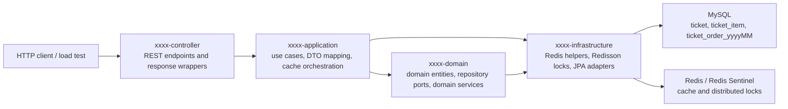

Important idea:

The domain module owns interfaces like `TickerOrderRepository`, `TicketDetailRepository`, and `OrderDeductionRepository`. The infrastructure module implements those interfaces with Spring Data JPA, `EntityManager`, Redis, and Redisson.

## Maven Module Map

Root `pom.xml` is an aggregator with these modules:

```text
xxxx-start
xxxx-controller
xxxx-application
xxxx-infrastructure
xxxx-domain
```

Dependency direction:

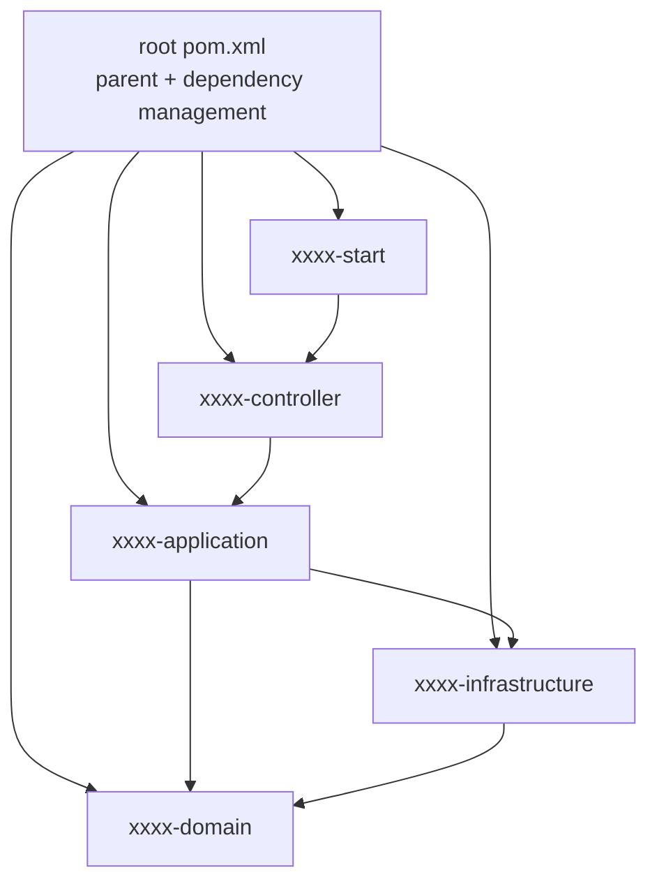

Module responsibilities:

| Module | Role | Key files |
|---|---|---|
| `xxxx-start` | Spring Boot entrypoint and runtime config | `StartApplication.java`, `application.yml` |
| `xxxx-controller` | REST API layer and response envelope | `TicketOrderController.java`, `TicketDetailController.java`, `HiController.java`, `ResultMessage.java`, `ResultUtil.java` |
| `xxxx-application` | Use cases, DTO conversion, cache orchestration, warmup job | `TicketOrderAppServiceImpl.java`, `TicketDetailAppServiceImpl.java`, `StockOrderCacheService.java`, `TicketDetailCacheServiceRefactor.java`, `WarmupDataBeforeEvent.java` |
| `xxxx-domain` | Entities, domain service interfaces/impls, repository ports | `TicketDetail.java`, `TickerOrder.java`, `TickerOrderDomainServiceImpl.java`, `TicketDetailDomainServiceImpl.java`, repository interfaces |
| `xxxx-infrastructure` | Persistence, Redis, Redisson, infrastructure adapters | `TickerOrderRepositoryImpl.java`, `OrderDeductionInfrasRepositoryImpl.java`, `TicketOrderJPAMapper.java`, `RedisInfrasServiceImpl.java`, `RedisDistributedLockerImpl.java` |

## Runtime Stack

Primary stack:

| Concern | Technology |
|---|---|
| Language | Java 21 |
| Framework | Spring Boot 3.3.5 in root dependency management, Spring Boot Maven plugin 3.4.0 in modules |
| Web | Spring MVC |
| Persistence | Spring Data JPA, Hibernate, MySQL |
| Cache | Redis via `RedisTemplate` |
| Distributed lock | Redisson |
| Local cache | Guava cache, Caffeine dependency present but not actively used in current cache implementation |
| Resilience | Resilience4j rate limiter and circuit breaker |
| Observability | Actuator, Prometheus registry, Logstash encoder, Docker compose assets for Prometheus/Grafana/ELK |
| Load testing | JMeter bundle under `benchmark/` |

## Startup Path

Application entrypoint:

```text
xxxx-start/src/main/java/com/xxxx/StartApplication.java
```

Startup behavior:

1. `SpringApplication.run(StartApplication.class, args)` starts the app.
2. `@EnableScheduling` enables scheduled jobs.
3. A `RestTemplate` bean is registered for outbound HTTP calls in `HiController`.
4. `WarmupDataBeforeEvent.loadDataTicketItemOnce()` runs after bean construction and warms Redis stock for ticket id `4L`.

Startup diagram:

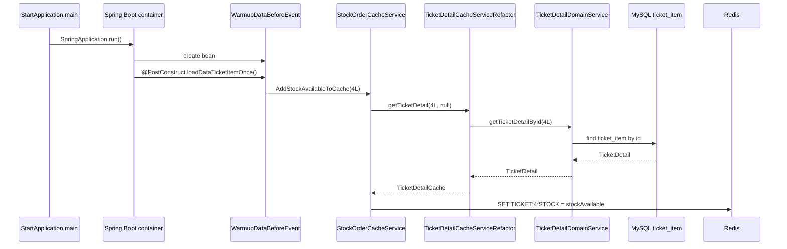

Runtime config:

```text
server.port = 1122
spring.datasource.url = jdbc:mysql://localhost:3316/vetautet
spring.datasource.username = root
spring.datasource.password = root1234
spring.jpa.hibernate.ddl-auto = none
spring.data.redis.sentinel.master = mymaster
spring.data.redis.sentinel.nodes = localhost:26379, localhost:26380, localhost:26381
spring.data.redis.password = 123456
spring.threads.virtual.enabled = true
```

Important mismatch to know:

`environment/docker-compose-dev.yml` starts a single Redis on port `6319`, but `application.yml` and `RedissonConfig` currently expect Redis Sentinel on ports `26379`, `26380`, and `26381`. If you start only `docker-compose-dev.yml`, the app's Sentinel Redis config may not connect unless the Sentinel compose is also running or config is changed.

## REST API Surface

### Ticket Detail API

Controller:

```text
xxxx-controller/src/main/java/com/xxxx/ddd/controller/http/TicketDetailController.java
```

Endpoints:

| Method | Path | Purpose | Returns |
|---|---|---|---|
| `GET` | `/ticket/ping/java` | Artificial 1 second ping endpoint | `{"status":"OK"}` |
| `GET` | `/ticket/{ticketId}/detail/{detailId}?version={version}` | Read ticket detail by detail id | `ResultMessage<TicketDetailDTO>` |
| `GET` | `/ticket/{ticketId}/detail/{detailId}/order` | Invalidate ticket detail cache for a user order action | `boolean` |

Note:

`ticketId` is present in the URL but the current implementation reads by `detailId`.

### Ticket Order API

Controller:

```text
xxxx-controller/src/main/java/com/xxxx/ddd/controller/http/TicketOrderController.java
```

Endpoints:

| Method | Path | Purpose | Returns |
|---|---|---|---|
| `GET` | `/order/{ticketId}/{quantity}/order` | Level 1/2 stock deduction path | `boolean` |
| `GET` | `/order/{ticketId}/{quantity}/cas` | Level 3 path: Redis Lua stock check, DB deduction, order insert | `boolean` |
| `GET` | `/order/{userId}/list?ntable={yyyyMM}` | List orders from a monthly table | `ResultMessage<List<TicketOrderDTO>>` |
| `GET` | `/order/{userId}/{orderNumber}` | Find one order by order number | `ResultMessage<TicketOrderDTO>` |

Note:

`getOrderByUser` passes `"2025xx"` to the app service, but the app service ignores it and derives `yyyyMM` from the timestamp encoded at the end of the order number.

### Hello / Resilience API

Controller:

```text
xxxx-controller/src/main/java/com/xxxx/ddd/controller/http/HiController.java
```

Endpoints:

| Method | Path | Purpose |
|---|---|---|
| `GET` | `/hello/hi` | Calls `EventAppService.sayHi("Hi")`, guarded by Resilience4j rate limiter `backendA` |
| `GET` | `/hello/hi/v1` | Calls `EventAppService.sayHi("Ho")`, guarded by rate limiter `backendB` |
| `GET` | `/hello/circuit/breaker` | Calls `https://fakestoreapi.com/products/{random}` with circuit breaker `checkRandom` |

## Main Flow 1: Basic Stock Deduction

Endpoint:

```text
GET /order/{ticketId}/{quantity}/order
```

GitNexus process:

```text
OrderTicketByLevel -> GetStockAvailable
OrderTicketByLevel -> DecreaseStockLevel1
```

Flow:

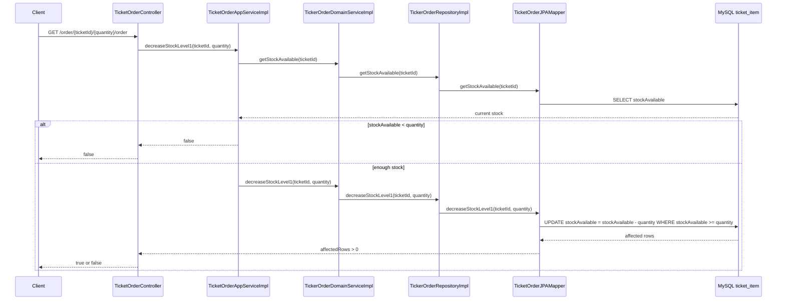

Key methods:

| Step | Method | File |
|---|---|---|
| 1 | `orderTicketByLevel` | `TicketOrderController.java` |
| 2 | `decreaseStockLevel1` | `TicketOrderAppServiceImpl.java` |
| 3 | `getStockAvailable`, `decreaseStockLevel1` | `TickerOrderDomainServiceImpl.java` |
| 4 | `getStockAvailable`, `decreaseStockLevel1` | `TickerOrderRepositoryImpl.java` |
| 5 | `getStockAvailable`, `decreaseStockLevel1` | `TicketOrderJPAMapper.java` |

Concurrency behavior:

The final stock update uses:

```text
WHERE t.id = :ticketId AND t.stockAvailable >= :quantity
```

That condition makes the DB update atomic enough to prevent stock going below zero for this path. The separate pre-read is useful for early return/logging but the real guard is the update condition.

## Main Flow 2: Redis Lua Stock Deduction + DB Update + Order Insert

Endpoint:

```text
GET /order/{ticketId}/{quantity}/cas
```

Code path:

```text
TicketOrderController.orderTicketByLevel3
TicketOrderAppServiceImpl.decreaseStockLevel3CAS
StockOrderCacheService.decreaseStockCacheByLUA
TickerOrderDomainServiceImpl.decreaseStockLevel1
TickerOrderRepositoryImpl.decreaseStockLevel1
TicketOrderJPAMapper.decreaseStockLevel1
OrderDeductionDomainServiceImpl.insertOrder
OrderDeductionInfrasRepositoryImpl.insertOrder
```

Flow:

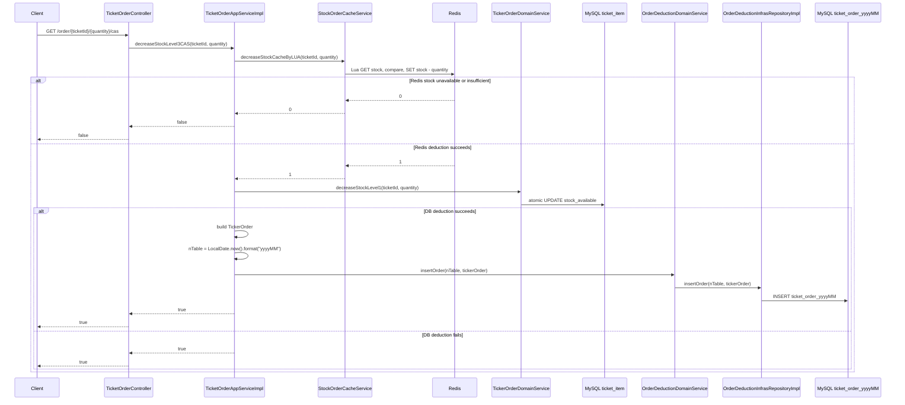

Important implementation details:

1. `StockOrderCacheService.decreaseStockCacheByLUA` executes a Lua script so Redis stock check and Redis stock decrement are atomic.
2. The Redis key format is `TICKET:{ticketId}:STOCK`.
3. `WarmupDataBeforeEvent` only warms ticket id `4L`.
4. The DB update currently uses `decreaseStockLevel1`, not the `decreaseStockLevel3CAS` method that accepts `oldStockAvailable`.
5. If Redis succeeds but the DB update fails, the app currently logs the failure but still returns `true`. That is important behavior to know before using this path as production logic.
6. Inserted order numbers look like `OKX-SGN-{userId}-{currentTimeMillis}`.
7. Orders are inserted into a monthly table named `ticket_order_yyyyMM`.

## Main Flow 3: Ticket Detail Read

Endpoint:

```text
GET /ticket/{ticketId}/detail/{detailId}?version={version}
```

Current active path:

```text
TicketDetailController.getTicketDetail
TicketDetailAppServiceImpl.getTicketDetailById
TicketDetailCacheServiceRefactor.getTicketDetail
TicketDetailDomainServiceImpl.getTicketDetailById
TicketDetailRepository.findById
TicketDetailInfrasRepositoryImpl.findById
TicketDetailJPAMapper.findById
```

Flow:

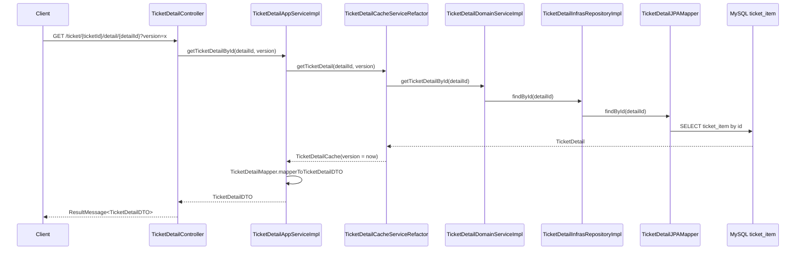

Important implementation detail:

`TicketDetailCacheServiceRefactor.getTicketDetail` currently has the intended cache flow commented out. The live code directly reads MySQL each time, wraps the result in `TicketDetailCache`, and sets `version` to `System.currentTimeMillis()`.

The commented intended design is:

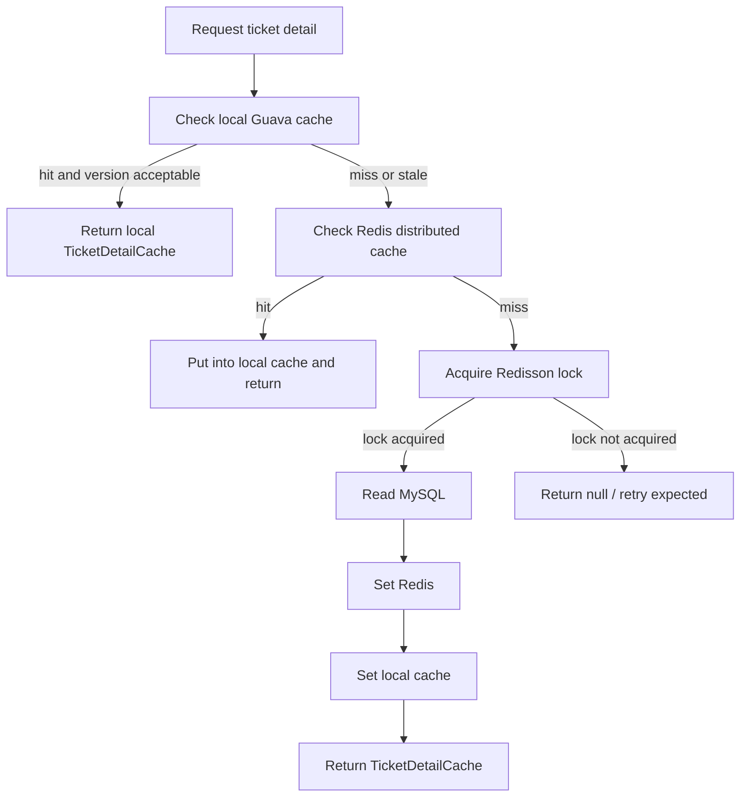

## Main Flow 4: Ticket Detail Cache Invalidation

Endpoint:

```text
GET /ticket/{ticketId}/detail/{detailId}/order
```

Flow:

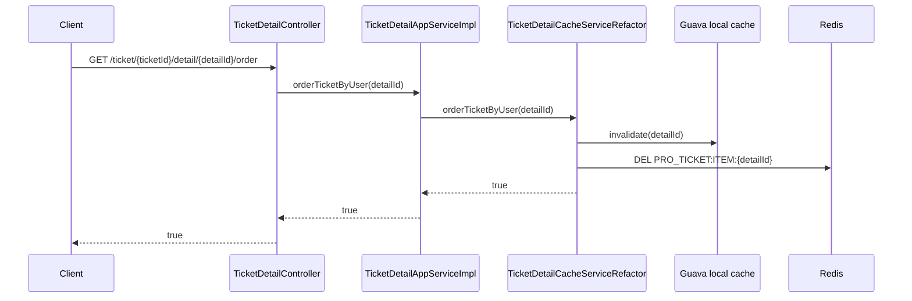

The endpoint name suggests "order ticket", but the current behavior only invalidates caches. It does not create an order or deduct DB stock.

## Main Flow 5: Order Query by Monthly Table

List endpoint:

```text
GET /order/{userId}/list?ntable=202502
```

Single order endpoint:

```text
GET /order/{userId}/{orderNumber}
```

Flow:

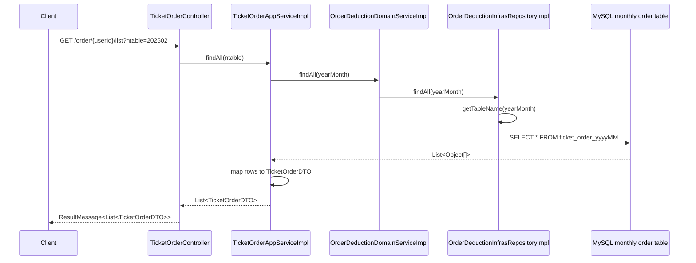

Table naming:

```text
ticket_order_ + yearMonth
```

Examples:

```text
ticket_order_202502
ticket_order_202604
```

Important security note:

`OrderDeductionInfrasRepositoryImpl` builds table names with string concatenation. The query values use parameters, but table names cannot be bound as parameters. Validate `yearMonth` strictly before using this style in production, for example `^[0-9]{6}$`.

## Main Flow 6: Hello and Resilience4j Demo

Endpoints:

```text
GET /hello/hi
GET /hello/hi/v1
GET /hello/circuit/breaker
```

GitNexus hello process:

```text
HiController.hello
EventAppServiceImpl.sayHi
HiDomainServiceImpl.sayHi
HiInfrasRepositoryImpl.sayHi
```

Flow:

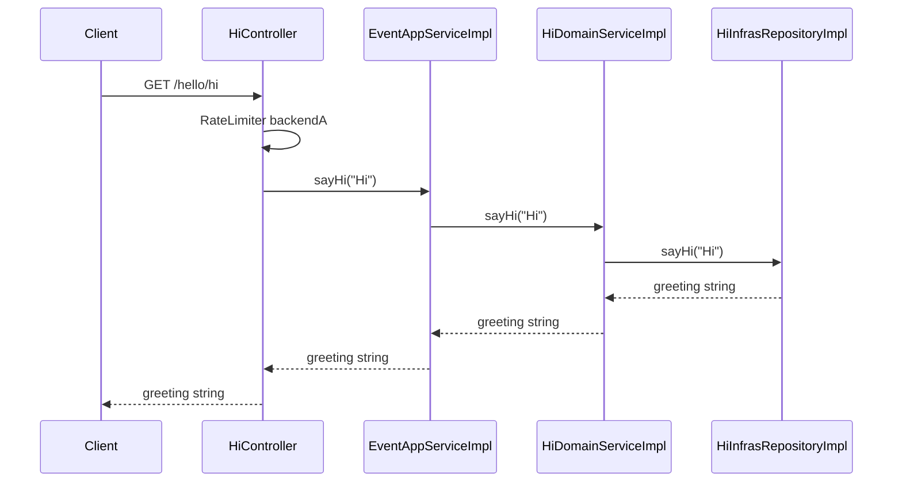

Circuit breaker path:

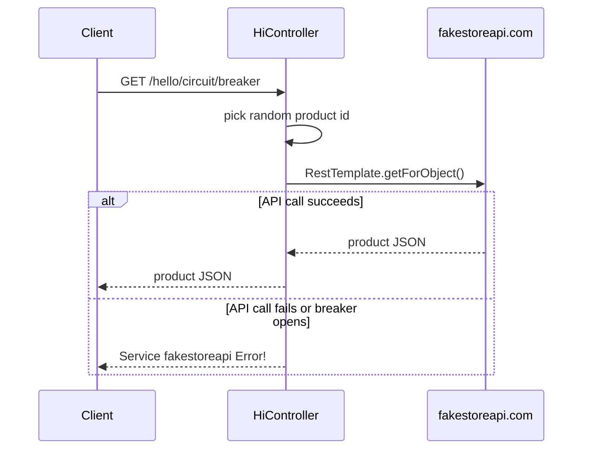

## Domain Model

### `Ticket`

Entity mapped by JPA:

```text
com.xxxx.ddd.domain.model.entity.Ticket
```

Fields:

```text
id, name, description, startTime, endTime, status, updatedAt, createdAt
```

DB table from SQL:

```text
ticket
```

### `TicketDetail`

Entity mapped to:

```text
ticket_item
```

Fields:

```text
id
name
description
stockInitial
stockAvailable
isStockPrepared
priceOriginal
priceFlash
saleStartTime
saleEndTime
status
activityId
updatedAt
createdAt
```

This is the central inventory entity. Most ordering paths update `stockAvailable`.

### `TickerOrder`

Plain domain model, not annotated as an entity:

```text
id
orderNumber
userId
totalAmount
terminalId
orderDate
orderNotes
updatedAt
createdAt
```

Orders are persisted with native SQL through `EntityManager`, not through a JPA entity.

## Database Schema

Initialization file:

```text
environment/mysql/init/ticket_init.sql
```

Database:

```text
vetautet
```

Tables created by the init script:

| Table | Purpose |
|---|---|
| `ticket` | Ticket event / sale campaign |
| `ticket_item` | Ticket SKU/detail row with stock and pricing |
| `ticket_order_202502` | Monthly order table |
| `ticket_order_details_202502` | Monthly order detail table |

Indexes:

| Table | Indexes visible in init script |
|---|---|
| `ticket` | `idx_end_time`, `idx_start_time`, `idx_status` |
| `ticket_item` | `idx_end_time`, `idx_start_time`, `idx_status` |
| `ticket_order_202502` | unique `order_number`, `order_date`, `index_usr_id` |
| `ticket_order_details_202502` | `order_number`, `ticket_item_id` |

## Cache Design

There are two different cache areas.

### Ticket Detail Cache

Files:

```text
TicketDetailCacheService.java
TicketDetailCacheServiceRefactor.java
TicketDetailCache.java
```

Key format:

```text
PRO_TICKET:ITEM:{ticketId}
PRO_LOCK_KEY_ITEM{ticketId}
```

Current active behavior:

`TicketDetailCacheServiceRefactor.getTicketDetail` bypasses local cache and Redis because the intended version-aware cache code is commented out. It reads from MySQL and returns a new version each time.

Intended design:

1. Read local Guava cache.
2. Compare client `version` with cached version.
3. If local cache is stale or missing, read Redis.
4. If Redis is missing, acquire Redisson lock.
5. Query MySQL once, set Redis, set local cache.
6. Invalidate both local and Redis when an order is placed.

### Stock Cache

File:

```text
StockOrderCacheService.java
```

Key format:

```text
TICKET:{ticketId}:STOCK
```

Warmup:

`WarmupDataBeforeEvent` runs at startup and calls:

```text
stockOrderCacheService.AddStockAvailableToCache(4L)
```

Lua decrement:

```text
GET stock
if stock >= quantity:
  SET stock = stock - quantity
  return 1
return 0
```

This makes Redis stock decrement atomic. However, Redis stock and DB stock can diverge if DB deduction or order insert fails after Redis has already decremented.

## Infrastructure Details

### Redis

`RedisConfig` registers a `RedisTemplate<Object, Object>` with string keys and Jackson JSON values.

`RedisInfrasServiceImpl` wraps common operations:

```text
setString / getString
setObject / getObject
delete
getRedisTemplate
setInt / getInt
```

Notes:

1. `setString` appears to have an inverted key validation check: it returns when `StringUtils.hasLength(key)` is true.
2. `getObject` handles Redis values that come back as `Map` or `String`, converting with Jackson.
3. `getInt` casts the Redis value directly to `int`; missing or differently typed values will fail.
4. `setObject` catches and suppresses exceptions.

### Redisson

`RedissonConfig` creates a Sentinel-backed `RedissonClient`:

```text
master = mymaster
sentinel nodes = localhost:26379, localhost:26380, localhost:26381
password = 123456
database = 0
```

`RedisDistributedLockerImpl` wraps Redisson `RLock` behind the project interface `RedisDistributedLocker`.

Unlock safety:

```text
if (isLocked() && isHeldByCurrentThread()) {
    rLock.unlock();
}
```

This avoids unlocking a lock held by another thread.

### Persistence

Spring Data JPA mappers:

```text
TicketDetailJPAMapper extends JpaRepository<TicketDetail, Long>
TicketOrderJPAMapper extends JpaRepository<TicketDetail, Long>
```

Manual native SQL repository:

```text
OrderDeductionInfrasRepositoryImpl
```

Why both styles exist:

1. `TicketDetailJPAMapper` handles normal entity reads.
2. `TicketOrderJPAMapper` handles stock update queries against `TicketDetail`.
3. `OrderDeductionInfrasRepositoryImpl` handles dynamic monthly order table names, which JPA repositories cannot model cleanly.

## GitNexus Execution Flow Summary

The most useful GitNexus-confirmed flows:

| Flow | Steps | Meaning |
|---|---:|---|
| `OrderTicketByLevel -> GetStockAvailable` | 5 | Controller to DB stock read |
| `OrderTicketByLevel -> DecreaseStockLevel1` | 5 | Controller to atomic DB stock decrement |
| `OrderTicketByLevel3 -> DecreaseStockLevel1` | 5 | CAS endpoint eventually calls DB decrement |
| `GetListOrderByUser -> GetTableName` | 5 | Controller to dynamic monthly table query |
| `GetOrderByUser -> GetTableName` | 5 | Controller to dynamic monthly table lookup |
| `Hello -> SayHi` | 4 | Resilience endpoint through DDD layers |

GitNexus also indexed many processes from vendored Grafana/JMeter assets, such as `OnValuesDataQueryChange -> V`. Treat those as environment/tooling noise unless you are specifically changing observability assets.

## How to Run Locally

Start local infrastructure:

```powershell
docker compose -f environment/docker-compose-dev.yml up -d
```

Build:

```powershell
mvn clean package
```

Run:

```powershell
mvn -pl xxxx-start spring-boot:run
```

Application URL:

```text
http://localhost:1122
```

Smoke test examples:

```powershell
curl http://localhost:1122/ticket/ping/java
curl "http://localhost:1122/ticket/1/detail/4"
curl "http://localhost:1122/order/4/1/order"
curl "http://localhost:1122/order/4/1/cas"
curl "http://localhost:1122/order/1/list?ntable=202502"
curl "http://localhost:1122/hello/hi"
```

Before expecting Redis to work, verify whether the app is configured for single Redis or Sentinel. Current code expects Sentinel.

## Suggested Learning Order

Read in this order:

1. `pom.xml`
2. `xxxx-start/src/main/java/com/xxxx/StartApplication.java`
3. `xxxx-start/src/main/resources/application.yml`
4. `xxxx-controller/src/main/java/com/xxxx/ddd/controller/http/TicketOrderController.java`
5. `xxxx-application/src/main/java/com/xxxx/ddd/application/service/order/impl/TicketOrderAppServiceImpl.java`
6. `xxxx-domain/src/main/java/com/xxxx/ddd/domain/service/impl/TickerOrderDomainServiceImpl.java`
7. `xxxx-infrastructure/src/main/java/com/xxxx/ddd/infrastructure/persistence/repository/TickerOrderRepositoryImpl.java`
8. `xxxx-infrastructure/src/main/java/com/xxxx/ddd/infrastructure/persistence/mapper/TicketOrderJPAMapper.java`
9. `xxxx-application/src/main/java/com/xxxx/ddd/application/service/order/cache/StockOrderCacheService.java`
10. `xxxx-application/src/main/java/com/xxxx/ddd/application/service/ticket/cache/TicketDetailCacheServiceRefactor.java`
11. `xxxx-infrastructure/src/main/java/com/xxxx/ddd/infrastructure/cache/redis/RedisInfrasServiceImpl.java`
12. `xxxx-infrastructure/src/main/java/com/xxxx/ddd/infrastructure/distributed/redisson/impl/RedisDistributedLockerImpl.java`
13. `environment/mysql/init/ticket_init.sql`

After those files, read:

```text
TicketDetailController.java
TicketDetailAppServiceImpl.java
TicketDetailDomainServiceImpl.java
TicketDetailInfrasRepositoryImpl.java
OrderDeductionInfrasRepositoryImpl.java
HiController.java
```

## Hotspots and Things to Watch

These are not edits, just learning notes from reading the code:

| Area | Why it matters |
|---|---|
| Redis Sentinel config | App expects Sentinel, dev compose starts a standalone Redis unless another compose is used |
| Cache refactor code | `TicketDetailCacheServiceRefactor.getTicketDetail` currently bypasses most of the intended cache logic |
| Redis/DB consistency | `/cas` decrements Redis first, then DB; no compensation is visible if DB/order insert fails |
| Return value in `/cas` | If DB decrement fails after Redis succeeds, method currently returns `true` |
| Dynamic table names | `ticket_order_yyyyMM` is assembled with string concatenation and needs strict validation |
| `RedisInfrasServiceImpl.setString` | Key validation looks inverted |
| Hardcoded startup warmup | Only ticket id `4L` is warmed at startup |
| Hardcoded credentials | MySQL and Redis passwords are committed in local config |
| `GET` for write operations | Stock decrement and order actions are exposed as `GET`, which is unsafe for real production APIs |
| Unused/placeholder methods | `decreaseStockLevel2`, `findByDateRange`, and some CAS variants are not fully implemented |
| Character encoding | Some comments and sample SQL text appear mojibake-encoded |

## Where to Add Changes Safely

When changing behavior, follow the layer boundary:

| Desired change | Likely starting point |
|---|---|
| Add a new HTTP endpoint | `xxxx-controller/.../controller/http` |
| Add a use case | `xxxx-application/.../service` |
| Add business rule | `xxxx-domain/.../service` |
| Add persistence operation | domain repository interface plus infrastructure implementation |
| Add Redis behavior | `RedisInfrasService` and `RedisInfrasServiceImpl` |
| Add lock behavior | `RedisDistributedLocker` / `RedisDistributedService` abstractions |
| Add DTO fields | application model and mapper |
| Add DB table/seed data | `environment/mysql/init/ticket_init.sql` |

Because this repo is GitNexus-indexed, run impact analysis before editing methods/classes:

```text
gitnexus_impact({ target: "TicketOrderAppServiceImpl", direction: "upstream", repo: "xxxx.com-27-04-25" })
gitnexus_context({ name: "decreaseStockLevel3CAS", repo: "xxxx.com-27-04-25" })
gitnexus_detect_changes({ scope: "all", repo: "xxxx.com-27-04-25" })
```

## Quick Glossary

| Term | Meaning in this repo |
|---|---|
| `Ticket` | Sale activity or event |
| `TicketDetail` / `ticket_item` | Concrete ticket item/SKU with stock |
| `TickerOrder` | Order model used when inserting into monthly order tables |
| `Level 1` | DB stock check plus conditional DB decrement |
| `Level 3` / `CAS` | Redis Lua decrement before DB stock decrement and order insert |
| `version` | Cache version timestamp returned with ticket detail |
| `nTable` / `yearMonth` | Monthly table suffix like `202502` |
| `PRO_TICKET:ITEM:{id}` | Redis key for ticket detail cache |
| `TICKET:{id}:STOCK` | Redis key for stock count |
| `PRO_LOCK_KEY_ITEM{id}` | Redisson lock key for loading ticket detail cache |

## Mermaid Overview: End-to-End System

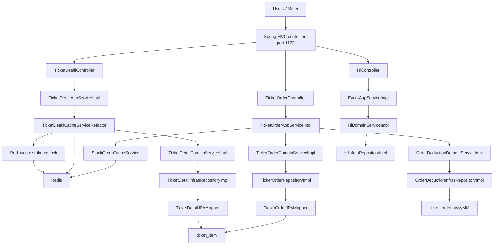

## Mermaid Overview: Layered Call Rules

```mermaid
flowchart LR
    subgraph Controller["Controller layer"]
        C1["REST annotations"]
        C2["ResultMessage wrapper"]
    end

    subgraph Application["Application layer"]
        A1["Use-case orchestration"]
        A2["DTO mapping"]
        A3["Cache decisions"]
        A4["Transaction boundary"]
    end

    subgraph Domain["Domain layer"]
        D1["Entity model"]
        D2["Domain services"]
        D3["Repository ports"]
    end

    subgraph Infrastructure["Infrastructure layer"]
        I1["JPA repositories"]
        I2["Native SQL"]
        I3["RedisTemplate"]
        I4["Redisson lock"]
    end

    Controller --> Application
    Application --> Domain
    Application --> Infrastructure
    Domain --> Infrastructure
```

## GitNexus Commands for Future Exploration

Use these when learning a specific area:

```text
gitnexus_query({
  repo: "xxxx.com-27-04-25",
  query: "ticket order flow controller application domain repository redis stock deduction"
})
```

```text
gitnexus_context({
  repo: "xxxx.com-27-04-25",
  name: "TicketOrderAppServiceImpl"
})
```

```text
gitnexus_context({
  repo: "xxxx.com-27-04-25",
  name: "TicketDetailCacheServiceRefactor"
})
```

```text
gitnexus_query({
  repo: "xxxx.com-27-04-25",
  query: "redisson distributed lock redis cache repository jpa mapper"
})
```

## Fast Review Checklist

If you only have 30 minutes:

1. Read this guide's module map and API surface.
2. Read `TicketOrderController`.
3. Read `TicketOrderAppServiceImpl.decreaseStockLevel1`.
4. Read `TicketOrderAppServiceImpl.decreaseStockLevel3CAS`.
5. Read `StockOrderCacheService.decreaseStockCacheByLUA`.
6. Read `TicketOrderJPAMapper`.
7. Read `OrderDeductionInfrasRepositoryImpl`.
8. Read `application.yml` and compare Redis config with Docker compose.

If you only have 2 hours:

1. Do the 30 minute path.
2. Read the ticket detail cache services.
3. Read all domain repository interfaces and infrastructure implementations.
4. Read `ticket_init.sql`.
5. Run the app locally and hit the smoke test endpoints.
6. Use GitNexus `context` on every method you plan to change.
