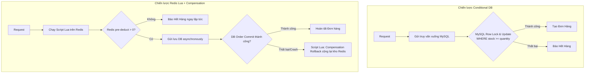

# ⚡ High-Concurrency Flash Sale Inventory Engine (Lab)

[](https://openjdk.org/)
[](https://spring.io/projects/spring-boot)
[](https://redis.io/)
...
[](https://www.mysql.com/)
[](https://jmeter.apache.org/)

Một dự án nghiên cứu chuyên sâu (Concurrency Backend Lab) về tối ưu hóa hiệu năng trừ kho (inventory deduction) trong các chiến dịch Flash Sale dưới tải trọng cực lớn. Dự án mô phỏng và thực nghiệm so sánh **4 chiến lược trừ kho** khác nhau, chứng minh trực quan cách ngăn ngừa hiện tượng **overselling (bán quá số lượng)**, đo lường độ trễ (latency), băng thông (throughput) và cách thiết lập cơ chế bù trừ (compensation) để đạt tính nhất quán dữ liệu giữa Cache và DB.

---

## 🎯 4 Chiến Lược Trừ Kho & Đối Chiếu Thực Nghiệm

| Chiến Lược | Cơ Chế Kỹ Thuật | Khả Năng Oversell | Peak Throughput | Talkpoint Phỏng Vấn |
|---|---|---|---|---|
| ❌ **`UNSAFE_DB`** | Trừ kho trực tiếp bằng MySQL Update không kèm điều kiện. | **Bị Oversell nghiêm trọng** | Cao (sai lệch) | Nhóm đối chứng (Control Group) chứng minh vì sao tranh chấp luồng (race condition) gây thất thoát hàng hóa. |
| 🛡️ **`CONDITIONAL_DB`** | MySQL atomic update: `WHERE stock_available >= quantity`. | **Không** | Thấp (Nghẽn cổ chai ở DB) | Khóa dòng ở DB ở mức cơ bản, an toàn nhưng bị thắt nút cổ chai khi kết nối tăng cao. |
| ⚡ **`REDIS_LUA`** | Dùng script Lua chạy nguyên tử trên Redis để pre-deduct. | **Không** | Rất cao | Giảm tải cho DB bằng cách lọc request thừa tại tầng cache, tuy nhiên có rủi ro lệch kho (cache-DB drift) nếu DB bị crash giữa chừng. |
| 🚀 **`REDIS_LUA_WITH_COMPENSATION`** | Redis pre-deduct + Rollback khi DB/Order tạo lỗi. | **Không** | **Rất cao (Tối ưu nhất)** | Kết hợp tối ưu giữa hiệu năng của Redis và tính nhất quán của MySQL qua cơ chế hoàn trả quota tự động. |

---

## 📐 So Sánh Hai Luồng Trừ Kho Điển Hình

Sơ đồ Mermaid dưới đây so sánh cơ chế khóa DB trực tiếp (`CONDITIONAL_DB`) và cơ chế lọc tải trước qua Redis kèm bù trừ (`REDIS_LUA_WITH_COMPENSATION`):



---

## 📊 Kết Quả Đo Đạc Hiệu Năng Thực Tế (Benchmark Results)

Kết quả đo đạc bằng Apache JMeter mô phỏng **5.000 requests** với độ đồng thời **100 threads** tranh mua **1.000 sản phẩm** (Warmed Stock):

| Chiến Lược | Throughput (req/s) | Latency Average | P95 Latency | Tỷ Lệ Oversell | Trạng Thái Nhất Quán |
|---|---|---|---|---|---|
| `CONDITIONAL_DB` | 38.64 req/s | 2,501 ms | 20,590 ms | **0.00%** | Nhất quán (Không dùng cache) |
| `REDIS_LUA` | 288.33 req/s | 275 ms | 598 ms | **0.00%** | Có thể lệch kho nếu DB lỗi |
| **`REDIS_LUA_WITH_COMPENSATION`** | **354.33 req/s** | **219 ms** | **477 ms** | **0.00%** | **Nhất quán hoàn toàn (Tự sửa lỗi)** |

> 💡 **Phân Tích**: Chiến lược **`REDIS_LUA_WITH_COMPENSATION`** mang lại tốc độ phản hồi nhanh hơn **11.4 lần** và băng thông xử lý (Throughput) cao gấp **9.1 lần** so với việc khóa trực tiếp dưới cơ sở dữ liệu (`CONDITIONAL_DB`), trong khi vẫn đảm bảo tuyệt đối không bán quá số lượng tồn kho thực tế.

---

## 📂 Tổ Chức Dự Án

```text
├── app/
│   └── backend/
│       ├── xxxx-domain/         # Mô hình nghiệp vụ cốt lõi (Ticket, Order, Stock)
│       ├── xxxx-application/    # Các dịch vụ xử lý và triển khai chiến lược (Strategy pattern)
│       ├── xxxx-infrastructure/ # Adapter tích hợp Redis lock, MySQL repository
│       └── xxxx-start/          # Cấu hình khởi chạy Spring Boot & Flyway migrations
├── benchmark/                   # Chứa file cấu hình JMeter (.jmx), PowerShell script tự động chạy load test
└── environment/                 # Cấu hình docker-compose thiết lập MySQL 8, Redis 7
```

---

## 🛠️ Hướng Dẫn Thiết Lập Cục Bộ (Local Run & Benchmark)

### 1. Khởi Động Database & Cache
```bash
docker compose -f environment/docker-compose-dev.yml up -d
```

### 2. Build và Khởi Chạy Ứng Dụng Spring Boot
```bash
# Compile toàn bộ module
mvn -pl app/backend/xxxx-start -am -DskipTests package

# Khởi chạy application (chạy trên cổng 1122)
java -jar app/backend/xxxx-start/target/xxxx-start-1.0-SNAPSHOT.jar
```
*Swagger UI docs: `http://localhost:1122/swagger-ui.html`*

### 3. Quy Trình Chạy Thử Nghiệm Đối Soát
Hệ thống cung cấp các API để quản trị viên reset và kiểm tra tính nhất quán trước/sau mỗi đợt benchmark:

```bash
# 1. Reset kho DB về 1000 sản phẩm
curl -X POST http://localhost:1122/admin/benchmarks/reset \
  -H "Content-Type: application/json" \
  -d "{\"ticketItemId\":4,\"stock\":1000,\"yearMonth\":\"202604\"}"

# 2. Làm nóng (Warmup) kho lên Redis
curl -X POST http://localhost:1122/admin/tickets/4/stock/warmup

# 3. Gửi lệnh tạo đơn thử nghiệm
curl -X POST http://localhost:1122/orders \
  -H "Content-Type: application/json" \
  -d "{\"ticketItemId\":4,\"userId\":42,\"quantity\":1,\"strategy\":\"REDIS_LUA_WITH_COMPENSATION\",\"idempotencyKey\":\"smoke-1\"}"

# 4. Kiểm tra đối soát chênh lệch dữ liệu giữa Redis và DB
curl "http://localhost:1122/admin/benchmarks/consistency?ticketItemId=4&yearMonth=202604"
```

### 4. Chạy Tự Động Hóa JMeter Benchmark
Sử dụng script PowerShell để tự động chạy và xuất báo cáo HTML:
```powershell
powershell -ExecutionPolicy Bypass -File benchmark/run-jmeter.ps1 -Strategy REDIS_LUA_WITH_COMPENSATION
```
*Kết quả đo đạc chi tiết sẽ được ghi nhận tại thư mục `benchmark/results/`.*
