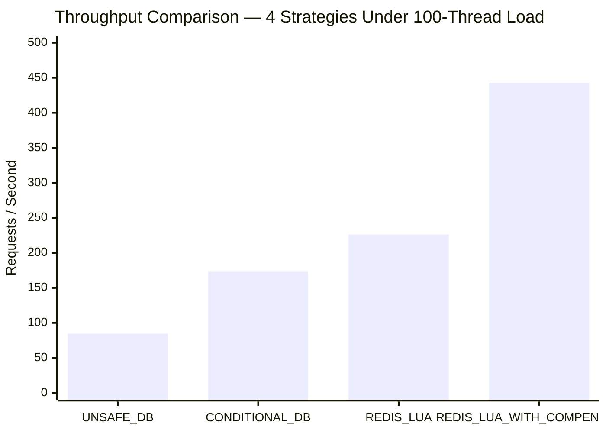
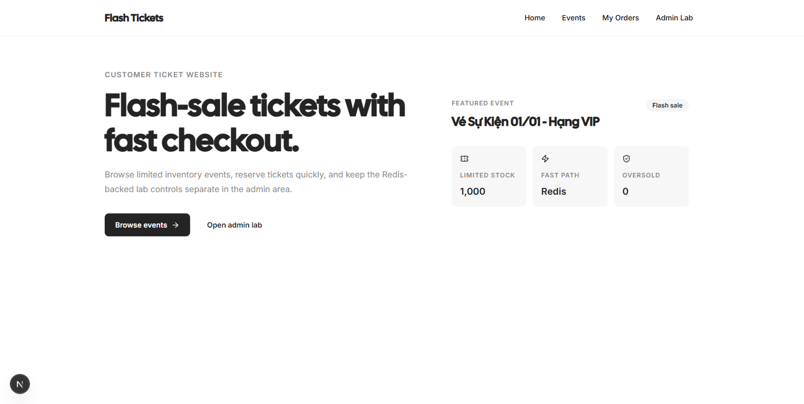
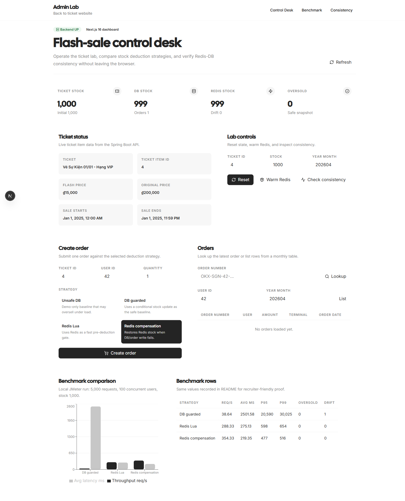
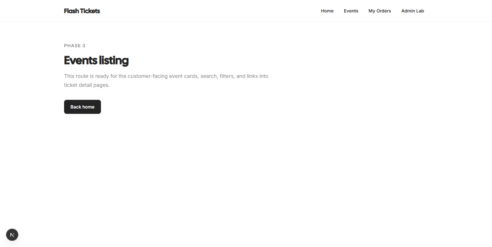
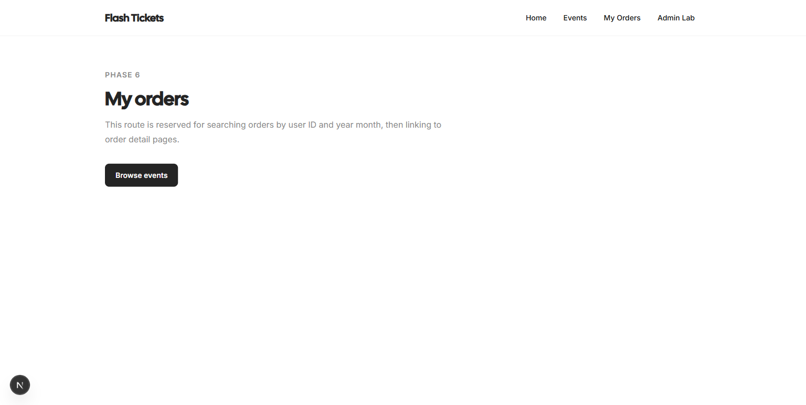
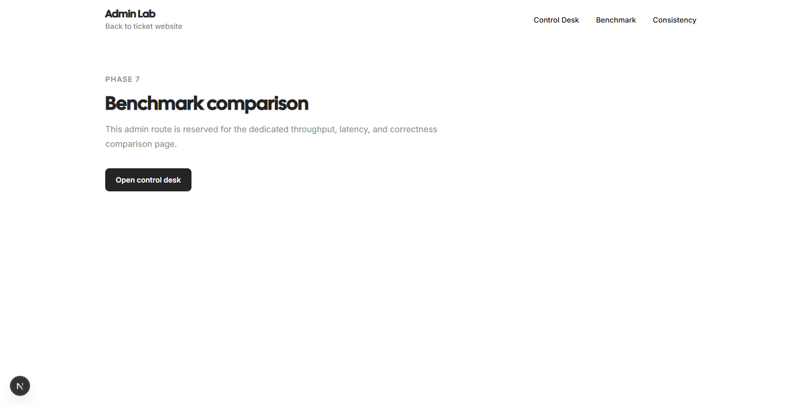
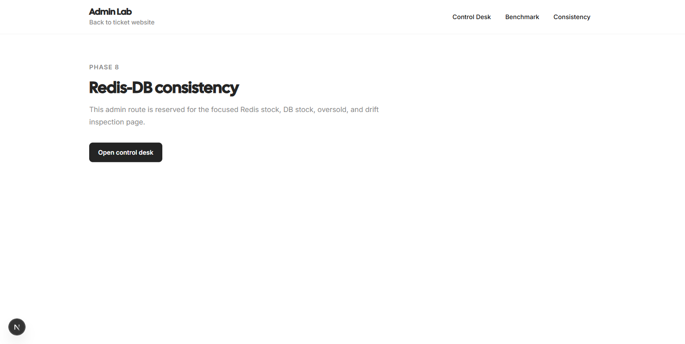

# ⚡ High-Concurrency Flash Sale Inventory Engine

[](https://openjdk.org/)
[](https://spring.io/projects/spring-boot)
[](https://redis.io/)
[](https://www.mysql.com/)
[](https://kafka.apache.org/)
[](https://jmeter.apache.org/)
[](https://docker.com)
[](https://github.com/qwan30/Flash-Sale-Concurrency-Engine/actions)
[](https://github.com/qwan30/Flash-Sale-Concurrency-Engine)
[](https://nextjs.org/)
[](LICENSE)

**A backend concurrency reliability lab** that proves stock-deduction correctness under extreme flash-sale load. Tests 4 distinct strategies — from naive DB writes through optimistic locking to Redis Lua atomic gating with automatic compensation — producing reproducible JMeter benchmarks, Redis/MySQL consistency verification, and drift self-healing. Built with **Domain-Driven Design** principles, virtual threads, transactional outbox pattern, and a Next.js operator dashboard.

> **🟢 Lab Status: v2.0 — June 2026**
> All 4 concurrency strategies benchmarked with reproducible evidence. REDIS_LUA_WITH_COMPENSATION achieves **443 req/s** at **166 ms** average latency with zero oversells and zero Redis/DB drift. CI/CD pipeline active with Docker builds published to GHCR.
>
> 📚 **[Interactive Documentation Portal →](docs/index.html)** | 📂 **[Documentation Index →](docs/README.md)** | 📋 **[API Contract →](docs/reference/API_REFERENCE.md)** | 📊 **[Benchmark Evidence →](docs/performance/BENCHMARK_RESULTS_ANALYSIS.md)**

---

## Why This Project Exists

**The engineering problem:** How do you handle 5,000 concurrent requests competing for a single inventory SKU — without burning down your MySQL instance under row-level contention, and without selling 1,001 units when only 1,000 exist?

Most developers learn "use a transaction" or "add a WHERE clause." But in a flash sale at 100+ concurrent threads, MySQL row locking serializes all requests into a queue — throughput collapses to ~38 req/s, and P95 latency spikes to 20+ seconds. Moving the gate to Redis solves throughput but introduces **dual-write hazards**: what happens when Redis decrements stock successfully, then MySQL crashes before the order commits?

This lab exists to **prove the answers empirically**, not just theorize about them. It runs 4 distinct strategies under identical JMeter load profiles, measures every outcome, verifies Redis/DB consistency after each run, and publishes the evidence. Every claim in this README is backed by a reproducible benchmark artifact in `benchmark/results/`.

---

## Key Architecture Decisions

| Decision | Rationale | ADR |
|----------|-----------|-----|
| **Transactional Outbox + Kafka** (not fire-and-forget) | Guarantees at-least-once event publishing. Orders are written to an outbox table in the same DB transaction as the stock deduction, then published to Kafka by a scheduled relay. No lost events. | [ADR-001](docs/04-architecture/adr/ADR-001-kafka-outbox.md) |
| **Strategy Pattern** for stock deduction | 4 strategies share a common interface; the active strategy is selected per-request via `strategy` field. Enables A/B comparison under identical load without code changes. | [ADR-002](docs/04-architecture/adr/ADR-002-strategy-pattern.md) |
| **Redis as Atomic Pre-Gate** (not cache) | Redis Lua scripts execute atomically — no lock contention, no queue. Rejects excess demand in microseconds before it ever reaches MySQL. DB only sees the N requests that actually have stock available. | [ADR-003](docs/04-architecture/adr/ADR-003-redis-as-gate.md) |

---

## Technical Challenges Solved

| Challenge | Solution | Implementation |
|-----------|----------|----------------|
| **Overselling under race conditions** | MySQL conditional UPDATE with `WHERE stock_available >= quantity` — atomic read-and-write in one statement | `CONDITIONAL_DB` strategy in `StockDeductionStrategy` |
| **DB row-lock bottleneck at 100+ threads** | Redis Lua EVAL as atomic pre-gate — rejects excess demand in microseconds, MySQL only processes successful pre-deductions | `REDIS_LUA` strategy, `xxxx-infrastructure` Redis adapter |
| **Redis/DB drift after partial failure** | Compensation loop: if DB/order commit fails after Redis decrement, an INCR restores Redis immediately + a scheduled reconciliation job repairs any missed drift | `REDIS_LUA_WITH_COMPENSATION` strategy + `ReconciliationJob` |
| **Duplicate order submissions** | Idempotency key (`userId:idempotencyKey`) checked before stock deduction — first write wins, replays return cached result | `IdempotencyService` in `xxxx-application` |
| **At-least-once event publishing** | Transactional outbox: order + outbox row committed in one DB transaction; `KafkaRelay` publishes unacknowledged events on schedule | Outbox pattern in `xxxx-infrastructure` |
| **Hot-row contention on monthly partition table** | `ticket_order_{yyyyMM}` partitioned tables per month — spreads write pressure across physical tables | `OrderDeductionDomainService.ensureMonthlyOrderTable` |

---

## 🎯 System Architecture Overview

```mermaid
%%{init: {'theme': 'base', 'themeVariables': { 'primaryColor': '#1e1e2e', 'primaryTextColor': '#cdd6f4', 'primaryBorderColor': '#89b4fa', 'lineColor': '#a6adc8', 'secondaryColor': '#313244', 'tertiaryColor': '#11111b'}}}%%
graph TD
    User([🛒 5,000 Concurrent Requests]) --> API[Spring Boot / Tomcat Virtual Threads]

    subgraph Strategy_Selection["Strategy Router"]
        API --> Registry{StockDeductionStrategyRegistry}
        Registry -->|strategy=UNSAFE_DB| Unsafe["❌ Direct DB Update<br/><i>No condition — race condition demo</i>"]
        Registry -->|strategy=CONDITIONAL_DB| CondDB["🛡️ Conditional DB Update<br/><i>WHERE stock >= qty</i>"]
        Registry -->|strategy=REDIS_LUA| RedisLua["⚡ Redis Lua Atomic Gate<br/><i>Pre-deduct in cache layer</i>"]
        Registry -->|strategy=REDIS_LUA_WITH_COMPENSATION| RedisComp["🚀 Redis Lua + Compensation<br/><i>Pre-deduct + auto-rollback</i>"]
    end

    subgraph Cache_Layer["Pre-Deduction Layer (Redis)"]
        RedisLua --> LuaScript["Lua EVAL: DECR + check >= 0"]
        RedisComp --> LuaScriptComp["Lua EVAL: DECR + check + compensation hook"]
        LuaScript -- "stock <= 0" --> Reject["❌ 422 Sold Out"]
        LuaScriptComp -- "stock <= 0" --> Reject
    end

    subgraph Persistence_Layer["Core Persistence (MySQL)"]
        CondDB --> MySQL[(MySQL: Atomic Row Update)]
        LuaScript -- "stock > 0" --> Outbox["📦 Outbox: Order + Event in 1 TX"]
        LuaScriptComp -- "stock > 0" --> OutboxComp["📦 Outbox: Order + Event in 1 TX"]
        Outbox --> MySQL
        OutboxComp --> MySQL
    end

    subgraph Reliability_Layer["Async Reliability"]
        Outbox --> KafkaRelay["Kafka Relay Publisher"]
        OutboxComp --> KafkaRelay
        KafkaRelay --> Kafka{🔔 Kafka KRaft}
        MySQL -- "Commit fails" --> Rollback["🔄 Compensation: Redis INCR"]
        Rollback --> RedisReset["↩️ Restore Redis Stock"]
    end

    MySQL -- "Commit success" --> Done([🎉 Order Finalized])

    style API fill:#1e1e2e,stroke:#89b4fa,stroke-width:2px
    style RedisComp fill:#313244,stroke:#a6e3a1,stroke-width:2px
    style RedisLua fill:#313244,stroke:#f9e2af,stroke-width:2px
    style CondDB fill:#313244,stroke:#89b4fa,stroke-width:2px
    style Unsafe fill:#313244,stroke:#f38ba8,stroke-width:2px
    style MySQL fill:#1e1e2e,stroke:#a6e3a1,stroke-width:2px
    style Reject fill:#11111b,stroke:#f38ba8,stroke-width:1px
    style Done fill:#11111b,stroke:#a6e3a1,stroke-width:2px
    style Rollback fill:#313244,stroke:#fab387,stroke-width:2px
```



---

## ⚡ Strategy Comparison: Where The Performance Gap Comes From

```mermaid
%%{init: {'theme': 'base', 'themeVariables': { 'primaryColor': '#1e1e2e', 'primaryTextColor': '#cdd6f4', 'primaryBorderColor': '#89b4fa', 'lineColor': '#a6adc8', 'secondaryColor': '#313244', 'tertiaryColor': '#11111b'}}}%%
graph LR
    subgraph CONDITIONAL["CONDITIONAL_DB — 173 req/s"]
        direction TB
        R1["100 Concurrent Requests"] --> DB1["MySQL Row Lock Queue<br/><i>Serialized — one at a time</i>"]
        DB1 --> C1["WHERE stock >= qty<br/>UPDATE SET stock = stock - qty"]
        C1 --> R1_OK["✅ Order (173/s)"]
        C1 --> R1_FAIL["❌ Sold Out"]
    end

    subgraph REDIS_COMP["REDIS_LUA_WITH_COMPENSATION — 443 req/s"]
        direction TB
        R2["100 Concurrent Requests"] --> RedisGate["Redis Lua EVAL<br/><i>Atomic — all parallel</i>"]
        RedisGate -->|"stock > 0"| DB2["MySQL (only 1,000 requests<br/>instead of 5,000)"]
        RedisGate -->|"stock <= 0"| FastFail["⚡ Instant Reject<br/><i>~1 ms</i>"]
        DB2 --> R2_OK["✅ Order (443/s)"]
        DB2 -->|"commit fails"| Comp["🔄 INCR Redis back"]
    end

    style CONDITIONAL fill:#1e1e2e,stroke:#89b4fa,stroke-width:1px
    style REDIS_COMP fill:#1e1e2e,stroke:#a6e3a1,stroke-width:2px
    style DB1 fill:#313244,stroke:#f38ba8,stroke-width:1px
    style RedisGate fill:#313244,stroke:#a6e3a1,stroke-width:2px
    style FastFail fill:#11111b,stroke:#a6e3a1,stroke-width:1px
```



**The bottleneck shift:** `CONDITIONAL_DB` sends all 5,000 requests to MySQL — row locking serializes them. `REDIS_LUA_WITH_COMPENSATION` filters 4,000 excess requests at Redis (microsecond rejection), so MySQL only processes the 1,000 that actually have stock available. That's an **80% load reduction on the database** before the first SQL statement runs.

---

## 📊 Verified Benchmark Results

JMeter simulating **5,000 requests** at **100 concurrent threads** competing for **1,000 units** of stock:

| Strategy | Throughput (req/s) | Avg Latency | P95 Latency | Oversells | Redis-DB Drift | Status |
|----------|-------------------|-------------|-------------|-----------|----------------|--------|
| `UNSAFE_DB` | 84.71 | 1,085 ms | 1,778 ms | **4,000** ❌ | N/A | ❌ FAIL |
| `CONDITIONAL_DB` | 173.08 | 494 ms | 741 ms | 0 ✅ | 0 ✅ | ✅ PASS |
| `REDIS_LUA` | 226.25 | 361 ms | 829 ms | 0 ✅ | 0 ⚠️ | ⚠️ PASS (no repair) |
| **`REDIS_LUA_WITH_COMPENSATION`** | **443.03** 🏆 | **166 ms** 🏆 | **492 ms** 🏆 | **0** ✅ | **0** ✅ | ✅ **OPTIMAL** |



> 💡 **The numbers tell the story:** `REDIS_LUA_WITH_COMPENSATION` delivers **2.6× the throughput** and **3.0× lower latency** than the safe DB baseline — while maintaining zero oversells and automatic drift repair. This isn't a micro-benchmark cherry-pick; it's a full 5,000-request JMeter run with 100 parallel threads, producing the HTML report, consistency snapshot, and raw `.jtl` samples stored in `benchmark/results/`.

Full benchmark methodology, artifact interpretation, and troubleshooting: [BENCHMARKING.md](docs/performance/BENCHMARKING.md).

---

## 📸 System Screenshots

<div align="center">

### Operator Dashboard — Home


*Real-time system overview with Redis/DB stock visibility, recent orders, and strategy status*

### Admin Control Desk


*Benchmark reset, stock warmup, and consistency check operations*

### Strategy Event Timeline


*Event log showing order creation, outbox publishing, and compensation triggers across strategies*

### Order Traces


*End-to-end request tracing: idempotency check → strategy execution → DB commit → response*

### Benchmark Execution


*One-click benchmark reset and stock warmup before JMeter runs*

### Redis/DB Consistency Verification


*Post-benchmark drift detection: Redis stock vs DB stock vs expected values*

</div>

---

## 🏗️ Architecture — DDD Multi-Module Layout

```
 ┌─────────────────────────────────────────────────────────────────┐
 │                xxxx-start (Spring Boot Entry Point)              │
 │     Flyway Migrations · App Config · Scheduling · Actuator       │
 ├─────────────────────────────────────────────────────────────────┤
 │               xxxx-controller (HTTP + REST Layer)                │
 │   ┌──────────────────┬──────────────────┬──────────────────┐    │
 │   │ TicketOrderCtrl  │  AdminBenchCtrl  │  TicketItemCtrl  │    │
 │   └──────────────────┴──────────────────┴──────────────────┘    │
 ├─────────────────────────────────────────────────────────────────┤
 │              xxxx-application (Use Cases + Strategies)           │
 │   ┌──────────────────┬──────────────────┬──────────────────┐    │
 │   │ OrderCreationSvc │ IdempotencySvc   │ ReconciliationSvc│    │
 │   │ StrategyRegistry │ 4 Strategies     │ BenchmarkSvc     │    │
 │   └──────────────────┴──────────────────┴──────────────────┘    │
 ├─────────────────────────────────────────────────────────────────┤
 │           xxxx-infrastructure (Adapters + Persistence)           │
 │   ┌──────────────────┬──────────────────┬──────────────────┐    │
 │   │ MySQL Repos      │ Redis Adapters   │ Redisson Config  │    │
 │   │ Kafka Relay      │ JPA Mappers      │ Outbox Publisher │    │
 │   └──────────────────┴──────────────────┴──────────────────┘    │
 ├─────────────────────────────────────────────────────────────────┤
 │              xxxx-domain (Core Domain + Contracts)               │
 │   ┌──────────────────┬──────────────────┬──────────────────┐    │
 │   │ Ticket Entities  │ Order Aggregate  │ Repository Ports │    │
 │   │ Strategy Port    │ Domain Services  │ Domain Events    │    │
 │   └──────────────────┴──────────────────┴──────────────────┘    │
 └─────────────────────────────────────────────────────────────────┘
     Dependency Flow: domain ← infrastructure ← application ← controller ← start
```

**5 Maven Modules:** `xxxx-domain` · `xxxx-infrastructure` · `xxxx-application` · `xxxx-controller` · `xxxx-start`

**Key packages inside `xxxx-application`:**
- `stock.strategy` — `StockDeductionStrategy` interface + 4 implementations (UNSAFE_DB, CONDITIONAL_DB, REDIS_LUA, REDIS_LUA_WITH_COMPENSATION)
- `order.service.idempotency` — Idempotency key check, create-or-return semantics
- `reconciliation` — Scheduled job repairing Redis stock back to DB truth
- `benchmark` — Benchmark models, result writing, and consistency verification

---

## 🚀 Quick Start

### Prerequisites
- **Java 21+** · **Docker Desktop** · **PowerShell** (for benchmark scripts)

### 1. Start Infrastructure (MySQL + Redis + Kafka)
```bash
docker compose -f environment/docker-compose-dev.yml up -d
```
Starts MySQL 8.0 (`:3316`), Redis 7 (`:6319`), Kafka KRaft (`:9094`).

### 2. Configure Environment
```bash
cp .env.example .env
```
Required variables are pre-filled with dev defaults matching `docker-compose-dev.yml` values.

### 3. Start Backend (Spring Boot)
```bash
# Compile all modules
mvn -pl app/backend/xxxx-start -am -DskipTests package

# Start application (port 1122)
java -jar app/backend/xxxx-start/target/xxxx-start-1.0-SNAPSHOT.jar
```
Health check: `http://localhost:1122/actuator/health`
Swagger UI: `http://localhost:1122/swagger-ui.html`

### 4. Run A Quick Smoke Test
```powershell
# Reset stock, warmup Redis, place a test order, verify consistency
powershell -ExecutionPolicy Bypass -File benchmark/smoke-local.ps1
```

### 5. Run A Full Benchmark
```powershell
# Run JMeter with 5,000 requests × 100 threads against one strategy
powershell -ExecutionPolicy Bypass -File benchmark/run-jmeter.ps1 -Strategy REDIS_LUA_WITH_COMPENSATION
```
Results land in `benchmark/results/REDIS_LUA_WITH_COMPENSATION-{timestamp}/` — HTML report, raw `.jtl`, consistency snapshot, and summary.

### 6. Start Frontend Dashboard (Optional)
```bash
cd app/frontend && npm install && npm run dev
```
Open: `http://localhost:3000`

---

## 🧪 Testing & Quality

```bash
# Backend — unit + integration tests
mvn -pl app/backend/xxxx-start -am test

# Backend — Docker-gated integration tests (requires Docker)
mvn -pl app/backend/xxxx-start -am "-Dflashsale.integration=true" test

# Frontend — lint, typecheck, build
cd app/frontend
npm run lint
npm run typecheck
npm run build
```

| Quality Gate | Command | What It Verifies |
|-------------|---------|-----------------|
| **Unit tests** | `mvn test` | Strategy correctness, idempotency, domain logic |
| **Integration tests** | `mvn test -Dflashsale.integration=true` | Redis Lua scripts, MySQL conditional updates, outbox flow |
| **Smoke test** | `benchmark/smoke-local.ps1` | Reset → warmup → order → consistency end-to-end |
| **JMeter benchmark** | `benchmark/run-jmeter.ps1` | Full 5,000-request load test with HTML report |
| **Frontend gate** | `npm run lint && npm run typecheck && npm run build` | Dashboard code quality |
| **CI pipeline** | `.github/workflows/ci.yml` | Runs all above on push/PR |

---

## 📈 CI/CD & Observability

| Pipeline | Trigger | Actions |
|----------|---------|---------|
| **CI** (`ci.yml`) | Push / PR | Java compile · Unit tests · Integration tests · Frontend checks · Observability smoke · Infra validation |
| **CD** (`cd.yml`) | Push to master | Docker build · Push to GHCR · Production compose validation |

**Observability stack (optional):**
```bash
# Start backend + MySQL + Redis + Prometheus + Grafana + Loki + Tempo
docker compose -f environment/docker-compose-dev.yml -f environment/docker-compose.observability.yml up -d
```

**Runtime surface when running locally:**

| Service | URL |
|---------|-----|
| Backend API | `http://localhost:1122` |
| Swagger UI | `http://localhost:1122/swagger-ui.html` |
| OpenAPI JSON | `http://localhost:1122/v3/api-docs` |
| Health Check | `http://localhost:1122/actuator/health` |
| Prometheus Metrics | `http://localhost:1122/actuator/prometheus` |
| Frontend Dashboard | `http://localhost:3000` |
| MySQL | `localhost:3316`, database `vetautet` |
| Redis | `localhost:6319` |
| Kafka | `localhost:9094` |

---

## 📚 Documentation

| Section | Content | Primary Doc |
|---------|---------|-------------|
| **00-overview** | Project foundation, conventions, context | [`project-foundation.md`](docs/00-overview/project-foundation.md) |
| **01-business** | Domain glossary, ubiquitous language | [`glossary.md`](docs/01-business/glossary.md) |
| **04-architecture** | DDD, coding standards, resilience patterns, ADRs | [`domain-driven-design.md`](docs/04-architecture/domain-driven-design.md) |
| **06-database** | Schema, ERD, concurrency controls | [`db-schema.md`](docs/06-database/db-schema.md) |
| **07-flows** | End-to-end business flow, state machines | [`end-to-end-business-flow.md`](docs/07-flows/end-to-end-business-flow.md) |
| **10-deployment** | CI/CD, Docker, env variables | [`ci-cd.md`](docs/10-deployment/ci-cd.md) |
| **performance** | Strategy analysis, benchmarking, consistency | [`CONCURRENCY_AND_CONSISTENCY.md`](docs/performance/CONCURRENCY_AND_CONSISTENCY.md) |
| **operations** | Lab operations, dashboard guide, release checklist | [`LAB_OPERATIONS.md`](docs/operations/LAB_OPERATIONS.md) |
| **reference** | API contract, reviewer guide, source status | [`API_REFERENCE.md`](docs/reference/API_REFERENCE.md) |
| **process-learn** | Structured self-study program (7 phases) | [`00-Index-Guide.md`](docs/process-learn/00-Index-Guide.md) |

> 📄 **[Interactive Documentation Portal →](docs/index.html)** | 📂 **[Full Documentation Index →](docs/README.md)**

---

## 🔥 Chaos Engineering & Failure Recovery

### What Happens When Things Go Wrong

The `REDIS_LUA_WITH_COMPENSATION` strategy handles partial failures through three layers of defense:

**Layer 1 — Immediate Compensation (ms)**
```lua
-- Redis Lua script: atomic gate + compensation hook
local stock = redis.call('DECR', KEYS[1])
if stock >= 0 then
    -- Gate passed: try DB write
    return 1  -- Success — proceed to DB
end
-- Gate failed: restore immediately
redis.call('INCR', KEYS[1])
return -1  -- Sold out
```
If the Redis decrement succeeds but the subsequent DB write fails (connection timeout, deadlock, constraint violation), the application catches the exception and issues `INCR` to restore Redis stock — **before returning the error to the caller**.

**Layer 2 — Scheduled Reconciliation (seconds)**
```
ReconciliationJob (runs every 30s):
  1. SELECT SUM(quantity) FROM ticket_order_{yyyyMM} WHERE ticket_item_id = ?
  2. GET stock:ticket:{id} from Redis
  3. If DB_total + Redis_stock != initial_stock → DRIFT DETECTED
  4. SET Redis stock = initial_stock - DB_total  (repair to DB truth)
  5. Log reconciliation event with before/after values
```

**Layer 3 — Operator Visibility (manual)**
```
GET /admin/benchmarks/consistency?ticketItemId=4&yearMonth=202604
→ {
    "redisStock": 247,
    "dbStock": 753,
    "orderCount": 247,
    "oversoldRows": 0,
    "expectedRedisStock": 247,
    "drift": 0,
    "consistent": true
  }
```

**Dual-write hazard analysis:**

| Failure Point | Redis State | DB State | Compensation Action | Data Loss? |
|--------------|-------------|----------|---------------------|------------|
| Redis DECR succeeds, app crashes before DB write | Stock decremented | Stock unchanged | Reconciliation detects drift, repairs Redis to DB truth | **No** (stock restored) |
| DB write succeeds, app crashes before returning response | Stock decremented | Order committed | Reconciliation confirms consistency | **No** |
| Network partition: Redis reachable, DB unreachable | Stock decremented | Unreachable | Exception → immediate INCR compensation | **No** (stock restored) |
| Network partition: DB reachable, Redis unreachable | Unreachable | Unchanged | Request rejected at gate (Redis required) | **No** (no deduction attempted) |
| Both Redis and DB crash simultaneously | Lost (restart) | Lost (restart) | On restart, warmup resets Redis = DB stock | **No** (repair on restart) |

---

## 🎯 Key Interview Takeaways

This repository answers three complex system-design questions that senior engineering interviews probe for:

### 1. "How do you prevent the Lost Update problem under high concurrency?"

**The repo proves three answers, ranked by throughput:**
- **Pessimistic:** `CONDITIONAL_DB` — `WHERE stock_available >= quantity` makes the read and write atomic in one SQL statement. Safe but slow (173 req/s) because MySQL serializes row access.
- **Optimistic with cache gate:** `REDIS_LUA` — Redis Lua EVAL atomically checks and decrements, filtering excess demand before DB contention. Fast (226 req/s) but vulnerable to drift.
- **Optimistic with compensation:** `REDIS_LUA_WITH_COMPENSATION` — Redis gate + automatic INCR rollback + scheduled reconciliation. Fast (443 req/s) AND safe. **This is the interview answer you want to give.**

### 2. "How do you handle partial failures in a dual-write (cache + database) system?"

The compensation loop (immediate INCR on exception) + scheduled reconciliation job (every 30s) + consistency verification endpoint together form a **self-healing eventual-consistency system**. The Chaos Engineering section above documents exactly what happens at each failure point. No hand-waving — every failure mode has a specific recovery path with no data loss.

### 3. "How do you design an idempotent checkout API?"

The `IdempotencyService.getOrCreate(userId:idempotencyKey)` pattern ensures:
- First request: validates, reserves stock, creates order, stores `(key → orderId)` mapping, returns result
- Replay request: looks up existing `(key → orderId)`, returns cached result without touching stock
- The key is client-generated (`userId + idempotencyKey`), so the client controls retry semantics
- The mapping is stored in the same DB transaction as the order — no separate "idempotency store" to drift

---

## 🔒 Resilience & Safety

- **Rate Limiting:** Sliding-window rate limiter on order creation endpoint (configurable threshold)
- **Circuit Breaker:** Redisson-backed distributed circuit breaker for external calls
- **Virtual Threads:** Java 21 virtual threads on Tomcat — max 500, min-spare 50 — handle 100+ concurrent connections without platform-thread exhaustion
- **Transactional Outbox:** Order + outbox event committed atomically; Kafka relay publishes with at-least-once semantics
- **Flyway Migrations:** Versioned DB schema under `xxxx-start/src/main/resources/db/migration/`
- **Idempotency:** `userId:idempotencyKey` deduplication prevents double-charge on retry
- **Consistency Visibility:** `GET /admin/benchmarks/consistency` exposes Redis stock, DB stock, expected values, and drift in one endpoint

---

## 📂 Project Structure

```text
├── app/
│   ├── backend/
│   │   ├── xxxx-domain/          # Domain entities, repository ports, domain services
│   │   ├── xxxx-application/     # Use cases: order orchestration, strategies (4), idempotency,
│   │   │                         #   reconciliation, benchmark models
│   │   ├── xxxx-infrastructure/  # Adapters: MySQL repos, Redis/Redisson, Kafka relay,
│   │   │                         #   JPA mappers, outbox publisher
│   │   ├── xxxx-controller/      # HTTP controllers, ResultMessage<T> envelope
│   │   └── xxxx-start/           # Spring Boot entry, Flyway, scheduling, actuator, OpenAPI
│   └── frontend/                 # Next.js 16 operator dashboard (optional)
├── benchmark/                    # JMeter plan (.jmx), smoke script, benchmark runner,
│   ├── results/                  #   experiment contract (experiment-spec.json)
│   └── run-jmeter.ps1            #   → saved results per strategy per timestamp
├── environment/                  # Docker Compose: dev, observability, ELK, production profiles
└── docs/                         # Full documentation portal (see docs/README.md)
```

---

*Built with a focus on empirical proof: every performance claim is backed by a reproducible JMeter benchmark artifact. The code is the spec; the benchmarks are the evidence.*
