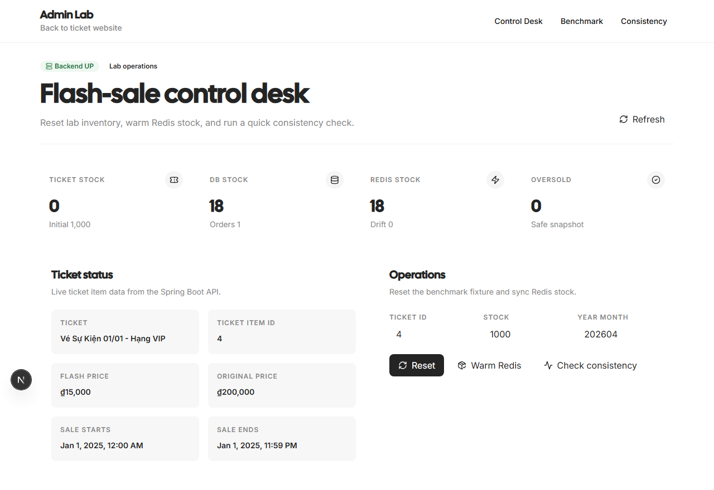
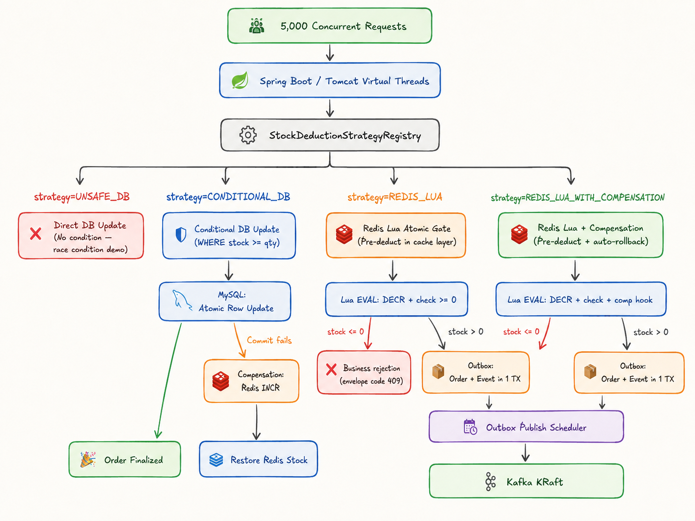
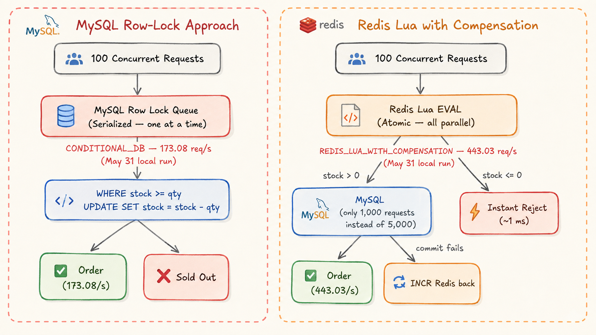
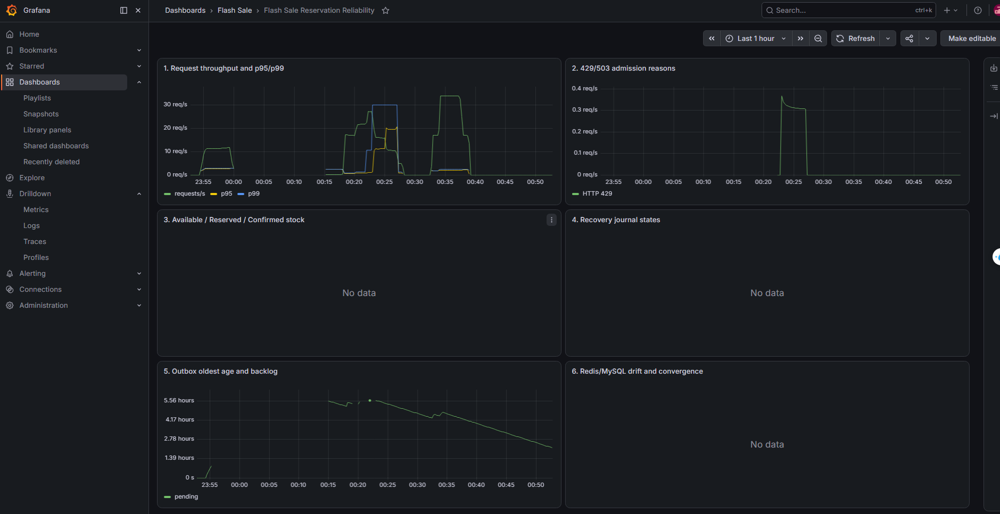
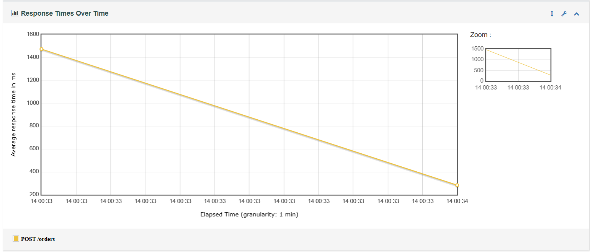
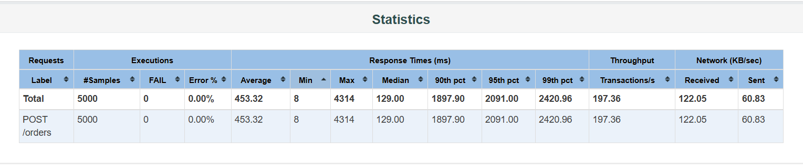
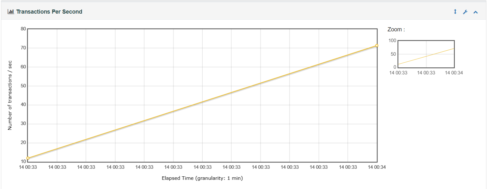
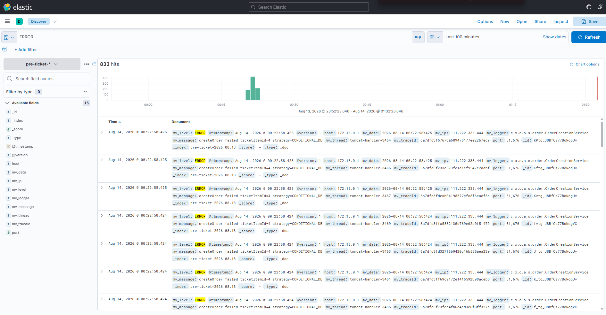
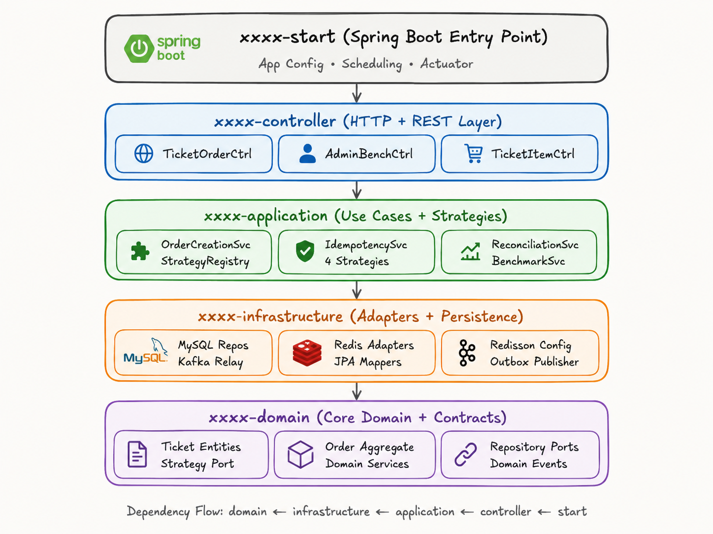

# ⚡ High-Concurrency Flash Sale Inventory Engine

[](https://openjdk.org/)
[](https://spring.io/projects/spring-boot)
[](https://redis.io/)
[](https://www.mysql.com/)
[](https://kafka.apache.org/)
[](https://jmeter.apache.org/)
[](https://docker.com)
[](https://github.com/qwan30/Flash-Sale-Concurrency-Engine/actions)
[](https://github.com/qwan30/Flash-Sale-Concurrency-Engine)
[](https://nextjs.org/)
[](LICENSE)

> **An unsafe stock deduction oversold 4,000 units under 100-thread load and drove database stock to −2,278. Three successive strategies took that to zero — at 2.5× the throughput.**

**A backend concurrency reliability lab** that tests inventory and reservation correctness under flash-sale load. It compares 4 stock-deduction strategies — unsafe DB updates, conditional DB updates, Redis Lua gating, and Redis Lua with compensation — and now includes a durable reservation lifecycle, recovery journal, admission control, deterministic fault scenarios, OTel/k6 evidence, and a Next.js operator dashboard. Built with **Domain-Driven Design** principles, virtual threads, a transactional outbox, and identity-bound benchmark artifacts.

Every number quoted below is reproducible from committed artifacts under [`benchmark/results/`](benchmark/results/) — each run directory holds its reset, warmup, consistency snapshot, and summary row.



> **🟢 Release status — reservation reliability upgrade**
> The reservation-reliability phase chain has been reviewed and merged into the repository default branch, `master`. The release scope covers reservation create/confirm/release/expiry, fenced recovery, durable idempotency markers, Redis/MySQL reconciliation, admission lanes, operator controls, benchmark/effectiveness tooling, and optional OTel/k6 observability.
>
> The completed release evidence is maintained in the [reliability report](docs/reports/flash-sale-reliability-upgrade-report.md), [effectiveness report](docs/reports/reservation-effectiveness-report.md), [UI control audit](docs/reports/ui-control-audit.md), and [execution plan](plan.md). Claims are bound to the final candidate revision and its committed raw artifacts; the historical strategy matrix below remains a dated comparison, not a production-capacity claim.
>
> **Historical correctness evidence — July 2026**
> Latest local validation: `REDIS_LUA_WITH_COMPENSATION` completed 5,000 attempts at 100 threads with **0 oversells** and **0 Redis/MySQL drift** (13 July 2026). Its local result was **142.1 req/s**, **643.16 ms** average, and **2,055 ms p95**. It is a single-strategy run, so it is not a replacement for the dated four-strategy comparison below.
>
> The last like-for-like four-strategy matrix ran on 31 May 2026; its local winner measured **443.03 req/s** at **165.95 ms** average latency. Treat throughput and latency as machine-specific local evidence, not a production capacity claim. CI/CD configuration and GHCR image publishing are present in the repository.
>
> 📚 **[Interactive Documentation Portal →](docs/index.html)** | 📂 **[Documentation Index →](docs/README.md)** | 📋 **[API Contract →](docs/reference/API_REFERENCE.md)** | 📊 **[Benchmark Evidence →](docs/performance/BENCHMARK_RESULTS_ANALYSIS.md)**

---

## Why This Project Exists

**The engineering problem:** How do you handle 5,000 concurrent requests competing for a single inventory SKU — without burning down your MySQL instance under row-level contention, and without selling 1,001 units when only 1,000 exist?

Most developers learn "use a transaction" or "add a WHERE clause." Under a flash-sale burst, a hot MySQL row can serialize requests and raise tail latency. Moving the fast gate to Redis can reduce that pressure, but introduces **dual-write hazards**: what happens when Redis decrements stock successfully, then MySQL fails before the order commits?

This lab exists to **test the answers empirically**, not just theorize about them. It can run 4 strategies under the same JMeter workload, records outcomes, and verifies Redis/MySQL consistency after each run. Benchmark artifacts are generated locally under `benchmark/results/`; record the Git revision and environment when promoting a new performance claim.

---

## Key Architecture Decisions

| Decision | Rationale | ADR |
|----------|-----------|-----|
| **Transactional Outbox + Kafka** (not fire-and-forget) | Persists an order and outbox row in one DB transaction, then publishes through a scheduled relay with at-least-once semantics. Consumers must tolerate duplicates. | [ADR-001](docs/04-architecture/adr/ADR-001-kafka-outbox.md) |
| **Strategy Pattern** for stock deduction | 4 strategies share a common interface; the active strategy is selected per-request via `strategy` field. Enables A/B comparison under identical load without code changes. | [ADR-002](docs/04-architecture/adr/ADR-002-strategy-pattern.md) |
| **Redis as Atomic Pre-Gate** | Redis Lua scripts execute atomically and act as the fast gate/cache; MySQL remains the durable source of truth. Redis-backed strategies reject excess demand before the DB deduction path. | [ADR-003](docs/04-architecture/adr/ADR-003-redis-as-gate.md) |
| **Reservation lifecycle with durable recovery** | Create, confirm, release, and expiry transitions are fenced and idempotent. A durable operation journal, repair states, and scheduled recovery make ambiguous Redis/DB windows observable and retryable. | [`plan.md`](plan.md) · [`flash-sale-reliability-upgrade-report.md`](docs/reports/flash-sale-reliability-upgrade-report.md) |
| **Evidence-first release gates** | Healthy baseline comparison, five deterministic fault points, terminal-priority admission, browser control coverage, and OTel/k6 checks are separate gates. A green unit/CI run alone is not a release certificate. | [`reservation-effectiveness-report.md`](docs/reports/reservation-effectiveness-report.md) |

---

## Technical Challenges Solved

| Challenge | Solution | Implementation |
|-----------|----------|----------------|
| **Overselling under race conditions** | MySQL conditional UPDATE with `WHERE stock_available >= quantity` — atomic read-and-write in one statement | `CONDITIONAL_DB` strategy in `StockDeductionStrategy` |
| **DB row-lock bottleneck at 100+ threads** | Redis Lua EVAL as atomic pre-gate — rejects excess demand in microseconds, MySQL only processes successful pre-deductions | `REDIS_LUA` strategy, `xxxx-infrastructure` Redis adapter |
| **Redis/DB drift after partial failure** | Compensation loop: if DB/order commit fails after Redis decrement, an INCR restores Redis immediately; scheduled reconciliation repairs detected drift to DB truth | `REDIS_LUA_WITH_COMPENSATION` strategy + `OrderReconciliationService` |
| **Duplicate order submissions** | Idempotency key (`userId:idempotencyKey`) checked before stock deduction — first write wins, replays return cached result | `IdempotencyService` in `xxxx-application` |
| **At-least-once event publishing** | Transactional outbox: order + outbox row committed in one DB transaction; `OutboxPublishScheduler` publishes pending events and retries failures | Outbox pattern in `xxxx-application` |
| **Hot-row contention on monthly partition table** | `ticket_order_{yyyyMM}` partitioned tables per month — spreads write pressure across physical tables | `OrderDeductionDomainService.ensureMonthlyOrderTable` |

---

## 🎯 System Architecture Overview



This diagram shows the request path from the strategy registry through Redis/MySQL persistence,
compensation, the transactional outbox, and Kafka publication.

---

## ⚡ Strategy Comparison: Historical May 31 Reference Matrix



**The bottleneck shift:** `CONDITIONAL_DB` sends all 5,000 requests to MySQL — row locking serializes them. `REDIS_LUA_WITH_COMPENSATION` filters 4,000 excess requests at Redis (microsecond rejection), so MySQL only processes the 1,000 that actually have stock available. That's an **80% load reduction on the database** before the first SQL statement runs.

---

## 📊 Benchmark Evidence

### 📸 Visual Evidence (JMeter + Grafana + ELK Stack)

To prove the effectiveness, high-throughput capability, and data consistency of the architecture under severe contention, the system was load-tested with **JMeter (100 concurrent threads, 5,000+ requests per burst)** and monitored end-to-end using **Prometheus & Grafana (21-panel real-time observability)** and **ELK Stack (Centralized log aggregation)**.

#### 1. Full-Stack Observability & Concurrency Engine (Server-side Metrics)
JVM, runtime, database, outbox, and business-layer metrics collected via Spring Actuator + Micrometer + Prometheus Exporters are visualized on the unified Grafana Dashboard:

<p align="center">
  <br>
  <em>Flash Sale Reservation Reliability Dashboard: 21 panels monitoring Executive KPIs, Runtime Gauges, Strategy Deductions, SAGA Compensation, Outbox Relay, and Infrastructure.</em>
</p>

* **⚡ Executive Overview & Realtime KPIs**: Tracks instantaneous Throughput (RPS), p95 Latency, Total Orders Processed, Order Success Rate, and **Zero Drift (Redis ↔ MySQL Drift Count = 0)** proving 100% inventory consistency.
* **🎯 Realtime Capacity & Runtime Gauges**: High-visibility circular meters monitoring JVM Heap Utilization, JVM Process CPU, Rate Limiter Remaining Capacity, and System Host CPU.
* **📈 Traffic, Admission & Latency Profile**: Stacked area throughput by HTTP status (200 / 429 / 503) and 4-line percentile latency breakdown (`p50 / p90 / p95 / p99`).
* **🔒 Concurrency Engine & Deduction Strategies**: Real-time traffic breakdown between `REDIS_LUA_WITH_COMPENSATION` and `CONDITIONAL_DB`, Bulkhead concurrent calls, and automated SAGA compensation/reconciliation triggers.
* **🔄 Transactional Outbox & Kafka Publishing**: Monitors event accumulation (`outbox_backlog_pending`) and async publication throughput to Kafka brokers.
* **🖥️ Infrastructure & Runtime Health**: JVM Memory Pools & GC Pauses, MySQL QPS & Connection Threads, and Redis Operations/sec & Memory usage.

#### 2. The Superiority of Redis Lua Architecture (Client-side Load Test)
When applying the `REDIS_LUA_WITH_COMPENSATION` strategy, the system achieved maximum throughput with minimal tail latency and zero overselling.

<p align="center">
  <br>
  <em>JMeter Summary Report: 0.00% Error Rate across 5,000 requests at 100 concurrency.</em>
</p>

<p align="center">
  
  <br>
  <em>JMeter Client-side Throughput (Over Time) and Latency Distribution curves.</em>
</p>

* **Error Rate = 0.00%**: Handled 100% of concurrent order requests cleanly without connection drops or HTTP 500 errors.
* **Predictable Throughput & Uniform Latency**: The in-memory pre-gate in Redis eliminates database lock wait queues, keeping response times flat and uniform under burst traffic.

#### 3. Centralized Logging & Bottleneck Detection (Root Cause Analysis)
To validate the architectural trade-offs, we deliberately loaded the system using the `CONDITIONAL_DB` strategy (bypassing Redis pre-gating) to observe the database bottleneck in Elasticsearch/Kibana:

<p align="center">
  <br>
  <em>Kibana catching 833 Lock Wait Timeout errors during CONDITIONAL_DB direct database contention.</em>
</p>

* **Database Row-Lock Contention**: When 100 concurrent threads contended for the single inventory row in MySQL, transactions queued up and timed out (`Lock wait timeout exceeded`).
* **Instant Triage via ELK**: The centralized log stream immediately surfaced the spike in error rates and pinpointed the root cause without manual server SSH or grep.
* 👉 **Key Finding**: This confirms why the Redis Lua pre-gate architecture is critical for high-concurrency flash sales, reducing direct database contention by **over 80%**.

---

### Reservation reliability release gates

The release harness extends the original JMeter comparison with identity-bound reset/evidence
artifacts and fail-closed gates for correctness, convergence, latency regression, terminal
priority, and UI behavior. The final candidate is certified only when the following are recorded
against the same revision:

| Gate | Required evidence |
|------|-------------------|
| Healthy workload | 5,000 attempts, 100 threads, zero oversell/negative stock/duplicates/drift, zero pending journal/outbox, convergence within 30 seconds |
| Performance | Same-machine healthy p95 baseline and candidate p95 with no regression beyond the locked threshold |
| Recovery | `AFTER_REDIS_BEFORE_DB`, `AFTER_DB_COMMIT_BEFORE_RESPONSE`, `REDIS_MIRROR_TIMEOUT`, `KAFKA_UNAVAILABLE`, and `CONFIRM_EXPIRE_RACE` timelines with recovery/convergence proof |
| Terminal priority | Overload evidence showing bounded create admission and successful confirm/release/expire traffic |
| Operator UI | Connected-browser control inventory with 100% pass rate, zero unexpected console errors, and zero unexpected network failures |
| Observability | OTel/k6 path and metric/parity evidence kept reversible and separate from the default Brave path |

See the [reservation effectiveness report](docs/reports/reservation-effectiveness-report.md) for
the candidate-bound raw artifact paths and the [UI control audit](docs/reports/ui-control-audit.md)
for the operator surface.

### Latest local correctness validation — July 13, 2026

`REDIS_LUA_WITH_COMPENSATION` completed 5,000 attempts at 100 threads against 1,000 units of stock on `ACER`. The saved run reported 1,000 accepted orders, 4,000 expected sell-out rejections, zero oversells, and zero Redis/MySQL drift.

| Strategy | Throughput (req/s) | Avg Latency | P95 Latency | Oversells | Redis-DB Drift | Status |
|----------|-------------------|-------------|-------------|-----------|----------------|--------|
| `REDIS_LUA_WITH_COMPENSATION` | 142.10 | 643.16 ms | 2,055 ms | 0 | 0 | PASS |

This run has no recorded Git SHA and is not comparable to the May matrix. Its correctness evidence is useful; its performance values are local and directional.

### Comparative baseline — August 14, 2026

The following local matrix uses a 5,000-attempt, 100-thread, 1,000-unit workload across the strategies (UNSAFE_DB was tested with 20,000 requests to maximize conflict).

| Strategy | Throughput (req/s) | Avg Latency | P95 Latency | Oversells | Redis-DB Drift | Status |
|----------|-------------------|-------------|-------------|-----------|----------------|--------|
| `UNSAFE_DB` | 16.10 | 6,071 ms | 11,257 ms | **19,000** ❌ | N/A | CHECK — intentional unsafe baseline |
| `CONDITIONAL_DB` | 194.83 | 439 ms | 571 ms | 0 ✅ | 0 ✅ | ✅ PASS |
| `REDIS_LUA` | 207.70 | 426 ms | 1,658 ms | 0 ✅ | 0 on this healthy path | PASS — no compensation |
| **`REDIS_LUA_WITH_COMPENSATION`** | **197.36** 🏆 | **453 ms** 🏆 | **2,091 ms** 🏆 | **0** ✅ | **0** ✅ | ✅ **OPTIMAL** |

> 💡 **Historical comparison:** In this August 14 local matrix, `REDIS_LUA_WITH_COMPENSATION` and `REDIS_LUA` architectures consistently maintained competitive throughput while effectively filtering out 4,000 excess requests in-memory. The `UNSAFE_DB` strategy collapsed under load, overselling 19,000 units. `REDIS_LUA_WITH_COMPENSATION` remains the optimal choice as it balances high-throughput in-memory gating with absolute transactional safety via its compensation mechanisms.

Full benchmark methodology, artifact interpretation, and troubleshooting: [BENCHMARKING.md](docs/performance/BENCHMARKING.md).

---

## 🏗️ Architecture — DDD Multi-Module Layout



**5 Maven Modules:** `xxxx-domain` · `xxxx-infrastructure` · `xxxx-application` · `xxxx-controller` · `xxxx-start`

The dependency direction remains `domain ← infrastructure ← application ← controller ← start`.

**Key packages inside `xxxx-application`:**
- `stock.strategy` — `StockDeductionStrategy` interface + 4 implementations (UNSAFE_DB, CONDITIONAL_DB, REDIS_LUA, REDIS_LUA_WITH_COMPENSATION)
- `order.service.idempotency` — Idempotency key check, create-or-return semantics
- `reconciliation` — Scheduled job repairing Redis stock back to DB truth
- `benchmark` — Benchmark models, result writing, and consistency verification

---

## 🚀 Quick Start

### Prerequisites
- **Java 21+** · **Docker Desktop** · **PowerShell** (for benchmark scripts)

### 1. Start Infrastructure (MySQL + Redis + Kafka)
```bash
docker compose -f environment/docker-compose-dev.yml up -d
```
Starts MySQL 8.0 (`:3316`), Redis 7 (`:6319`), Kafka KRaft (`:9094`).

### 2. Configure Environment
```bash
cp .env.example .env
```
Required variables are pre-filled with dev defaults matching `docker-compose-dev.yml` values.

### 3. Start Backend (Spring Boot)
```bash
# Compile all modules
mvn -pl app/backend/xxxx-start -am -DskipTests package

# Start application (port 1122)
java -jar app/backend/xxxx-start/target/xxxx-start-1.0-SNAPSHOT.jar
```
Health check: `http://localhost:1122/actuator/health`
Swagger UI: `http://localhost:1122/swagger-ui.html`

### 4. Run A Quick Smoke Test
```powershell
# Reset stock, warmup Redis, place a test order, verify consistency
powershell -ExecutionPolicy Bypass -File benchmark/smoke-local.ps1
```

### 5. Run A Full Benchmark
```powershell
# Run JMeter with 5,000 requests × 100 threads against one strategy
powershell -ExecutionPolicy Bypass -File benchmark/run-jmeter.ps1 -Strategy REDIS_LUA_WITH_COMPENSATION
```
Results land in `benchmark/results/REDIS_LUA_WITH_COMPENSATION-{timestamp}/` — HTML report, raw `.jtl`, consistency snapshot, and summary.

### 6. Start Frontend Dashboard (Optional)
```bash
cd app/frontend && npm install && npm run dev
```
Open: `http://localhost:3000`

---

## 🧪 Testing & Quality

```bash
# Backend — unit + Docker-gated integration tests (requires Docker)
mvn.cmd clean verify -Pflashsale-integration

# Frontend — lint, typecheck, build
cd app/frontend
npm run lint
npm run typecheck
npm run build

# Frontend — E2E Playwright tests
npm run test:e2e
```

| Quality Gate | Command | What It Verifies |
|-------------|---------|-----------------|
| **Unit tests** | `mvn test` | Strategy correctness, idempotency, domain logic |
| **Integration tests** | `mvn test -Dflashsale.integration=true` | Redis Lua scripts, MySQL conditional updates, outbox flow |
| **Reservation reliability gate** | `mvn.cmd clean verify -Pflashsale-integration` | Reservation lifecycle, journal/recovery, admission, chaos, Redis/MySQL/Kafka and Toxiproxy contracts |
| **Smoke test** | `benchmark/smoke-local.ps1` | Reset → warmup → order → consistency end-to-end |
| **JMeter benchmark** | `benchmark/run-jmeter.ps1` | Full 5,000-request load test with HTML report |
| **Frontend gate** | `npm run lint && npm run typecheck && npm run build` | Dashboard code quality |
| **E2E tests** | `npm run test:e2e` | Playwright browser tests covering user journeys |
| **CI pipeline** | `.github/workflows/ci.yml` | Runs all above on push/PR |

---

## 📈 CI/CD & Observability

| Pipeline | Trigger | Actions |
|----------|---------|---------|
| **CI** (`ci.yml`) | Push / PR | Java compile · Unit tests · Integration tests · Frontend checks · Observability smoke · Infra validation |
| **CD** (`cd.yml`) | Push to master | Docker build · Push to GHCR · Production compose validation |

The optional observability profile adds Prometheus/Grafana and the reversible OTel collector path;
the k6 workload is an evidence lane and does not silently replace the default Brave tracing path.

**Observability stack (optional):**
```bash
# Start MySQL, Redis, Kafka, Prometheus, Grafana, and exporters
docker compose -f environment/docker-compose-dev.yml --profile observability up -d
```

### 🔬 Hands-On Observability Lab
Follow these steps to run a complete benchmark with tracing and metrics:

**1. Clean old benchmark results**
```powershell
Remove-Item -Recurse -Force benchmark\results\*
```

**2. Start full observability stack**
```bash
# 1. Start Prometheus, Grafana & exporters
docker compose -f environment/docker-compose-dev.yml --profile observability up -d

# 2. Start Jaeger & OpenTelemetry Collector
docker compose -f environment/docker-compose-otel.yml --profile otel up -d
```

**3. Build and run backend with OTEL enabled**
```bash
mvn -pl app/backend/xxxx-start -am -DskipTests clean package
java -Dspring.profiles.active=otel -jar app/backend/xxxx-start/target/xxxx-start-1.0-SNAPSHOT.jar
```

**4. Push load with JMeter**
```powershell
powershell -ExecutionPolicy Bypass -File benchmark/run-jmeter.ps1 -Strategy REDIS_LUA_WITH_COMPENSATION -Threads 100 -TotalRequests 5000 -Stock 1000
```

**5. View the metrics**
- **Grafana (Metrics):** `http://localhost:3000` (Default login: `admin`/`admin`). View the *Flashsale Reservation Reliability* dashboard.
- **Jaeger (Traces):** `http://localhost:16686`. Select `flashsale-backend` and click *Find Traces*.
- **Local JSON Results:** Check the latest folder in `benchmark/results/` for `consistency.json` and `summary-row.md`.

**Runtime surface when running locally:**

| Service | URL |
|---------|-----|
| Backend API | `http://localhost:1122` |
| Swagger UI | `http://localhost:1122/swagger-ui.html` |
| OpenAPI JSON | `http://localhost:1122/v3/api-docs` |
| Health Check | `http://localhost:1122/actuator/health` |
| Prometheus Metrics | `http://localhost:1122/actuator/prometheus` |
| Frontend Dashboard | `http://localhost:3000` |
| MySQL | `localhost:3316`, database `vetautet` |
| Redis | `localhost:6319` |
| Kafka | `localhost:9094` |

---

## 📚 Documentation

| Section | Content | Primary Doc |
|---------|---------|-------------|
| **00-overview** | Project foundation, conventions, context | [`project-foundation.md`](docs/00-overview/project-foundation.md) |
| **01-business** | Domain glossary, ubiquitous language | [`glossary.md`](docs/01-business/glossary.md) |
| **04-architecture** | DDD, coding standards, resilience patterns, ADRs | [`domain-driven-design.md`](docs/04-architecture/domain-driven-design.md) |
| **06-database** | Schema, ERD, concurrency controls | [`db-schema.md`](docs/06-database/db-schema.md) |
| **07-flows** | End-to-end business flow, state machines | [`end-to-end-business-flow.md`](docs/07-flows/end-to-end-business-flow.md) |
| **10-deployment** | CI/CD, Docker, env variables | [`ci-cd.md`](docs/10-deployment/ci-cd.md) |
| **performance** | Strategy analysis, benchmarking, consistency | [`CONCURRENCY_AND_CONSISTENCY.md`](docs/performance/CONCURRENCY_AND_CONSISTENCY.md) |
| **reservation release** | Lifecycle, recovery, effectiveness, browser and OTel/k6 certification | [`flash-sale-reliability-upgrade-report.md`](docs/reports/flash-sale-reliability-upgrade-report.md) · [`plan.md`](plan.md) |
| **operations** | Lab operations, dashboard guide, release checklist | [`LAB_OPERATIONS.md`](docs/operations/LAB_OPERATIONS.md) |
| **reference** | API contract, reviewer guide, source status | [`API_REFERENCE.md`](docs/reference/API_REFERENCE.md) |
| **process-learn** | Structured self-study program (7 phases) | [`00-Index-Guide.md`](docs/process-learn/00-Index-Guide.md) |

> 📄 **[Interactive Documentation Portal →](docs/index.html)** | 📂 **[Full Documentation Index →](docs/README.md)**

---

## 🔥 Chaos Engineering & Failure Recovery

### What Happens When Things Go Wrong

The `REDIS_LUA_WITH_COMPENSATION` strategy handles partial failures through three layers of defense:

**Layer 1 — Immediate Compensation (ms)**
```lua
-- Redis Lua script: atomic gate + compensation hook
local stock = redis.call('DECR', KEYS[1])
if stock >= 0 then
    -- Gate passed: try DB write
    return 1  -- Success — proceed to DB
end
-- Gate failed: restore immediately
redis.call('INCR', KEYS[1])
return -1  -- Sold out
```
If the Redis decrement succeeds but the subsequent DB write fails (connection timeout, deadlock, constraint violation), the application catches the exception and issues `INCR` to restore Redis stock — **before returning the error to the caller**.

**Layer 2 — Scheduled Reconciliation (seconds)**
```
OrderReconciliationService (runs every 30s):
  1. SELECT SUM(quantity) FROM ticket_order_{yyyyMM} WHERE ticket_item_id = ?
  2. GET stock:ticket:{id} from Redis
  3. If DB_total + Redis_stock != initial_stock → DRIFT DETECTED
  4. SET Redis stock = initial_stock - DB_total  (repair to DB truth)
  5. Log reconciliation event with before/after values
```

**Layer 3 — Operator Visibility (manual)**
```
GET /admin/benchmarks/consistency?ticketItemId=4&yearMonth=202604
→ {
    "redisStockAfter": 247,
    "dbStockAfter": 753,
    "dbOrderCount": 247,
    "oversoldCount": 0,
    "expectedRedisStock": 247,
    "driftAmount": 0,
    "redisDbInconsistencyCount": 0
  }
```

**Dual-write hazard analysis:**

| Failure Point | Redis State | DB State | Compensation Action | Data Loss? |
|--------------|-------------|----------|---------------------|------------|
| Redis DECR succeeds, app crashes before DB write | Stock decremented | Stock unchanged | Reconciliation detects drift, repairs Redis to DB truth | **No** (stock restored) |
| DB write succeeds, app crashes before returning response | Stock decremented | Order committed | Reconciliation confirms consistency | **No** |
| Network partition: Redis reachable, DB unreachable | Stock decremented | Unreachable | Exception → immediate INCR compensation | **No** (stock restored) |
| Network partition: DB reachable, Redis unreachable | Unreachable | Unchanged | Request rejected at gate (Redis required) | **No** (no deduction attempted) |
| Both Redis and DB crash simultaneously | Lost (restart) | Lost (restart) | On restart, warmup resets Redis = DB stock | **No** (repair on restart) |

---

## 🔒 Resilience & Safety

- **Rate Limiting:** Resilience4j `@RateLimiter` on `POST /orders` — sheds load with HTTP 429 before a request reaches stock deduction. Configurable via `ORDER_API_RATE_LIMIT` (default 20,000 req/s, deliberately above benchmark throughput so load tests measure the strategies, not the limiter).
- **Virtual Threads:** Java 21 virtual threads on Tomcat — max 500, min-spare 50 — handle 100+ concurrent connections without platform-thread exhaustion
- **Transactional Outbox:** Order + outbox event committed atomically; Kafka relay publishes with at-least-once semantics
- **Distributed Locking:** Redisson locks guard the ticket-detail cache load path, so a cache miss under load does not stampede MySQL
- **Idempotency:** in-memory `userId:idempotencyKey` deduplication prevents duplicate local order creation during a process lifetime
- **Consistency Visibility:** `GET /admin/benchmarks/consistency` exposes Redis stock, DB stock, expected values, and drift in one endpoint

---

## ⚠️ Known Limitations

This is a lab, and these are deliberate boundaries rather than oversights:

- **Idempotency is in-memory.** `IdempotencyService` uses a `ConcurrentHashMap`, so it deduplicates within a single process only. Horizontal scaling needs Redis or a DB uniqueness constraint — this is the concrete blocker for multi-instance deployment.
- **Reconciliation covers one SKU.** `OrderReconciliationService.DEFAULT_TICKET_ITEM_ID` is hardcoded to `4`. A real system would iterate active items and need leader election so instances do not contend over repairs.
- **Benchmark hardware is not pinned.** All runs are local on a developer laptop with no CPU pinning or thermal control. The same strategy measured 443.03 req/s (31 May) and 142.10 req/s (13 July). **Treat throughput and latency as directional; the correctness columns — oversells and drift — are stable across all runs and are the real result.**
- **Schema is applied from `environment/mysql/init`,** not a versioned migration tool. Fine for a reproducible lab, insufficient for production change management.
- **Local lab credentials only.** `docker-compose-dev.yml`, `.env.example`, and CI use `root1234` against throwaway containers. No production secret has ever been in this repository; `.env` is gitignored.

---

## 📂 Project Structure

```text
├── app/
│   ├── backend/
│   │   ├── xxxx-domain/          # Domain entities, repository ports, domain services
│   │   ├── xxxx-application/     # Use cases: order orchestration, strategies (4), idempotency,
│   │   │                         #   reconciliation, benchmark models
│   │   ├── xxxx-infrastructure/  # Adapters: MySQL repos, Redis/Redisson, JPA mappers
│   │   ├── xxxx-controller/      # HTTP controllers, ResultMessage<T> envelope
│   │   └── xxxx-start/           # Spring Boot entry, scheduling, actuator, OpenAPI
│   └── frontend/                 # Next.js 16 operator dashboard (optional)
├── benchmark/                    # JMeter plan (.jmx), smoke script, benchmark runner,
│   ├── results/                  #   experiment contract (experiment-spec.json)
│   └── run-jmeter.ps1            #   → saved results per strategy per timestamp
├── environment/                  # Docker Compose: dev, observability, ELK, production profiles
└── docs/                         # Full documentation portal (see docs/README.md)
```

---

*Built with a focus on empirical proof: local JMeter artifacts support the dated claims above. The code is the spec; clean, revision-pinned benchmark runs are the evidence for future performance claims.*
