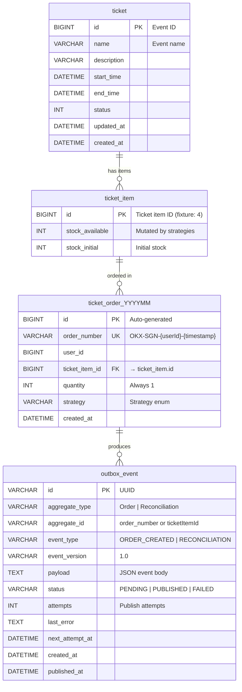

# Entity Relationship Diagram

> MySQL 8.0, database `vetautet`. Rendered with Mermaid.

## Relationships

| From | To | Type | Note |
|---|---|---|---|
| `ticket` | `ticket_item` | 1:N | Event fixture data |
| `ticket_item` | `ticket_order_YYYYMM` | 1:N | Orders reference item by FK |
| `ticket_order_YYYYMM` | `outbox_event` | 1:N | One `ORDER_CREATED` per order |

## Design Notes

1. **Monthly tables**: `ticket_order_YYYYMM` created on demand — avoids single-table hotspots.
2. **Outbox co-location**: Same DB as business data → atomic `@Transactional` writes.
3. **No FK on outbox**: `aggregate_id` is logical reference, not DB foreign key — keeps outbox decoupled.
4. **Compound indexes**: `(status, created_at)` for pending drain, `(status, next_attempt_at, created_at)` for retry queries.
