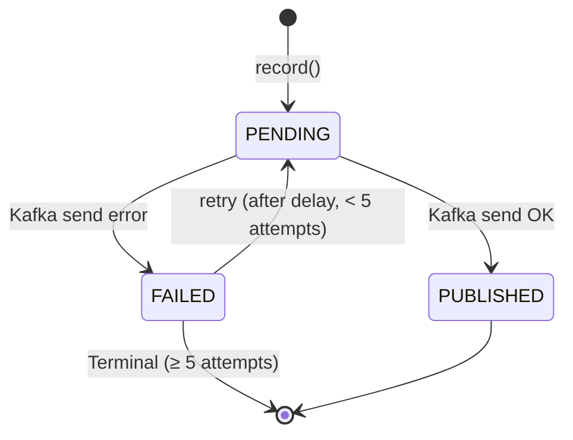
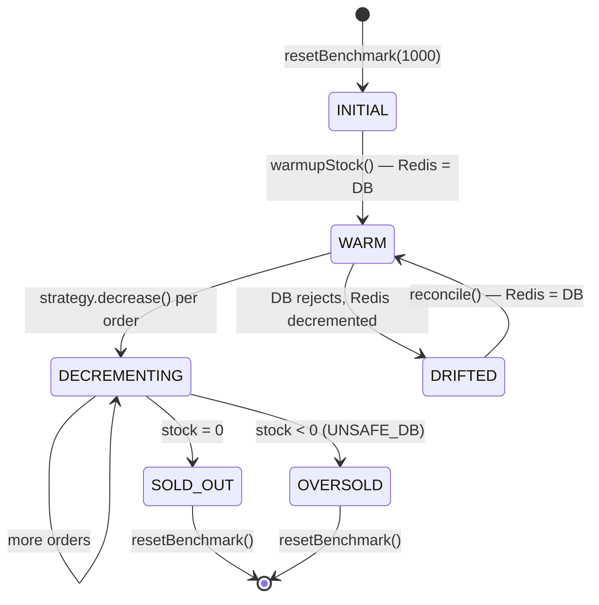
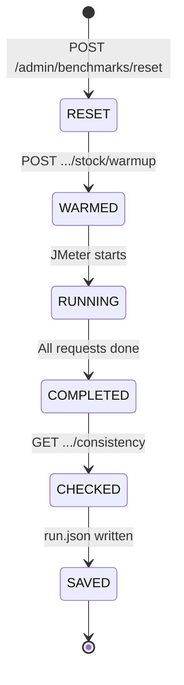

# State Machines

> Documented state machines for OutboxEvent, Stock lifecycle, and Benchmark runs.

## 1. OutboxEvent State Machine



| State | Entry | Meaning |
|---|---|---|
| `PENDING` | `record()` within `@Transactional` | Awaiting first publish |
| `PUBLISHED` | `kafkaTemplate.send()` OK | Delivered to Kafka |
| `FAILED` | Kafka error/timeout | Retryable or terminal |

| Transition | Trigger | Guard |
|---|---|---|
| → PENDING | `record()` | Called in `@Transactional` |
| PENDING → PUBLISHED | `publishPendingEvents()` | Kafka send OK within 5s |
| PENDING → FAILED | `publishPendingEvents()` | Any Kafka exception |
| FAILED → PENDING | `retryFailedEvents()` | `next_attempt_at ≤ NOW()` AND `attempts < 5` |
| FAILED → terminal | — | `attempts ≥ 5` |

**Metrics**: `outbox.publish.{success,failure,latency}`, `outbox.retry.scheduled`, `outbox.backlog.{pending,failed}`

## 2. Stock Lifecycle



| State | Safe Strategies | UNSAFE_DB |
|---|---|---|
| INITIAL | ✅ | ✅ |
| WARM (Redis = DB) | ✅ | ✅ |
| DECREMENTING (stock > 0) | ✅ | ✅ |
| SOLD_OUT (stock = 0) | ✅ | ✅ |
| OVERSOLD (stock < 0) | ❌ (should not happen) | ✅ (expected) |
| DRIFTED (Redis ≠ DB) | Possible after DB fail | N/A |

## 3. Order — Immutable

Orders are created once, never updated. No state machine.

```text
[CREATE] → EXISTS (immutable, single-state)
```

If insert fails → full transaction rollback. Idempotency key prevents duplicates on retry.

## 4. Benchmark Run Lifecycle



## 5. Reconciliation

```text
IDLE (every 30s)
  → CHECK: getConsistency()
    → drift = 0 → IDLE
    → drift ≠ 0 → REPAIR: setStockCache(id, dbStock)
                   → emit metric + outbox RECONCILIATION event
                   → IDLE
```
