# Class Diagram

This document provides a comprehensive Class Diagram representing the modular monolith structure, domain-driven layers (DDD), and key patterns (Strategy, Ports & Adapters) used in the Flash-Sale Concurrency Engine.

---

## 1. Class Diagram Layout

```mermaid
classDiagram
    %% --- LAYERS AND COMPONENTS ---

    %% CONTROLLER LAYER
    class TicketOrderController {
        -TicketOrderAppService appService
        +createOrder(CreateOrderRequest) ResultMessage~CreateOrderResponse~
        +listOrders(Long, String) ResultMessage~List~
    }

    class AdminBenchmarkController {
        -TicketOrderAppService appService
        +reset(BenchmarkResetRequest) ResultMessage~BenchmarkResetResponse~
        +getConsistency(Long, String) ResultMessage~ConsistencySnapshot~
    }

    %% APPLICATION LAYER - SERVICES
    class TicketOrderAppService {
        <<interface>>
        +createOrder(CreateOrderRequest) CreateOrderResponse
        +warmupStock(Long) CreateOrderResponse
        +resetBenchmark(BenchmarkResetRequest) BenchmarkResetResponse
        +getConsistency(Long, String) ConsistencySnapshot
        +insertOrder(String, TickerOrder) boolean
    }

    class TicketOrderAppServiceImpl {
        -OrderCreationService orderCreationService
        -BenchmarkFixtureService benchmarkFixtureService
        -ConsistencyCheckService consistencyCheckService
        -OrderQueryService orderQueryService
        +createOrder(CreateOrderRequest) CreateOrderResponse
    }

    class OrderCreationService {
        -TickerOrderDomainService tickerOrderDomainService
        -OrderDeductionDomainService orderDeductionDomainService
        -StockOrderCacheService stockOrderCacheService
        -StockDeductionStrategyRegistry strategyRegistry
        -IdempotencyService idempotencyService
        -OutboxService outboxService
        +createOrder(CreateOrderRequest) CreateOrderResponse
    }

    %% APPLICATION LAYER - STRATEGIES
    class StockDeductionStrategy {
        <<interface>>
        +decrease(CreateOrderRequest) StockDeductionResult
    }

    class StockDeductionStrategyRegistry {
        -Map~OrderStrategy, StockDeductionStrategy~ strategies
        +get(OrderStrategy) StockDeductionStrategy
    }

    class UnsafeDbStockDeductionStrategy {
        -TickerOrderDomainService tickerOrderDomainService
    }
    class ConditionalDbStockDeductionStrategy {
        -TickerOrderDomainService tickerOrderDomainService
    }
    class RedisLuaStockDeductionStrategy {
        -CacheStore cacheStore
    }
    class RedisLuaCompensatingStockDeductionStrategy {
        -CacheStore cacheStore
    }

    %% DOMAIN LAYER - ENTITIES
    class TickerOrder {
        -Long id
        -Integer userId
        -String orderNumber
        -BigDecimal totalAmount
        -String terminalId
        -LocalDateTime orderDate
        -String orderNotes
    }

    class TicketDetail {
        -Long id
        -Integer stockInitial
        -Integer stockAvailable
        -Boolean isStockPrepared
    }

    %% DOMAIN LAYER - SERVICES
    class OrderDeductionDomainService {
        <<interface>>
        +insertOrder(String, TickerOrder) void
        +ensureMonthlyOrderTable(String) void
    }

    class OrderDeductionDomainServiceImpl {
        -OrderDeductionRepository orderDeductionRepository
    }

    class TickerOrderDomainService {
        <<interface>>
        +decreaseStockLevel1(Long, int) boolean
        +decreaseStockLevel3CAS(Long, int, int) boolean
        +getStockAvailable(Long) int
    }

    class TickerOrderDomainServiceImpl {
        -TickerOrderRepository tickerOrderRepository
    }

    %% DOMAIN LAYER - PORTS (REPOSITORIES)
    class OrderDeductionRepository {
        <<interface>>
        +insertOrder(String, TickerOrder) void
        +ensureMonthlyOrderTable(String) void
    }

    class TicketDetailRepository {
        <<interface>>
        +findById(Long) Optional~TicketDetail~
    }

    class TickerOrderRepository {
        <<interface>>
        +decreaseStockLevel1(Long, int) boolean
        +decreaseStockLevel3CAS(Long, int, int) boolean
        +getStockAvailable(Long) int
    }

    %% INFRASTRUCTURE LAYER - ADAPTERS & MAPPERS
    class OrderDeductionInfrasRepositoryImpl {
        -EntityManager entityManager
    }

    class TicketDetailInfrasRepositoryImpl {
        -TicketDetailJPAMapper ticketDetailJPAMapper
    }

    class TickerOrderRepositoryImpl {
        -TicketOrderJPAMapper ticketOrderJPAMapper
    }

    class TicketDetailJPAMapper {
        <<interface>>
    }

    class TicketOrderJPAMapper {
        <<interface>>
        +decreaseStockLevel1(Long, int) int
        +decreaseStockLevel3CAS(Long, int, int) int
    }

    class CacheStore {
        <<interface>>
        +setInt(String, int) void
        +getInt(String) int
        +decreaseIntByLuaReturningRemaining(String, int) long
    }

    class RedisCacheStoreAdapter {
        -RedisInfrasService redisInfrasService
    }

    %% --- RELATIONSHIPS ---

    %% Inheritances & Implementations
    TicketOrderAppServiceImpl ..|> TicketOrderAppService
    OrderDeductionDomainServiceImpl ..|> OrderDeductionDomainService
    TickerOrderDomainServiceImpl ..|> TickerOrderDomainService

    UnsafeDbStockDeductionStrategy ..|> StockDeductionStrategy
    ConditionalDbStockDeductionStrategy ..|> StockDeductionStrategy
    RedisLuaStockDeductionStrategy ..|> StockDeductionStrategy
    RedisLuaCompensatingStockDeductionStrategy ..|> StockDeductionStrategy

    OrderDeductionInfrasRepositoryImpl ..|> OrderDeductionRepository
    TicketDetailInfrasRepositoryImpl ..|> TicketDetailRepository
    TickerOrderRepositoryImpl ..|> TickerOrderRepository
    RedisCacheStoreAdapter ..|> CacheStore

    %% Dependencies & Associations
    TicketOrderController --> TicketOrderAppService
    AdminBenchmarkController --> TicketOrderAppService

    TicketOrderAppServiceImpl --> OrderCreationService
    OrderCreationService --> TickerOrderDomainService
    OrderCreationService --> OrderDeductionDomainService
    OrderCreationService --> StockDeductionStrategyRegistry

    StockDeductionStrategyRegistry --> StockDeductionStrategy

    OrderDeductionDomainServiceImpl --> OrderDeductionRepository
    TickerOrderDomainServiceImpl --> TickerOrderRepository

    TicketDetailInfrasRepositoryImpl --> TicketDetailJPAMapper
    TickerOrderRepositoryImpl --> TicketOrderJPAMapper

    RedisLuaStockDeductionStrategy --> CacheStore
    RedisLuaCompensatingStockDeductionStrategy --> CacheStore

    %% Domain entities association
    TickerOrderDomainService ..> TickerOrder : operates on
    OrderDeductionDomainService ..> TickerOrder : operates on
    TicketDetailRepository ..> TicketDetail : operates on
```

---

## 2. Structural Highlights

### A. Ports and Adapters (Hexagonal Architecture)
The domain logic defines its database requirements via **Ports** (interfaces located in the Domain layer):
* `OrderDeductionRepository`
* `TicketDetailRepository`
* `TickerOrderRepository`

The **Infrastructure** layer implements these ports using concrete technologies (**Adapters**):
* `OrderDeductionInfrasRepositoryImpl` uses standard `EntityManager` for native SQL commands.
* `TickerOrderRepositoryImpl` and `TicketDetailInfrasRepositoryImpl` delegate queries to **Spring Data JPA Mappers** (`TicketOrderJPAMapper` and `TicketDetailJPAMapper`).

### B. Strategy Pattern for Stock Deduction
The application layer isolates different concurrent stock deduction algorithms behind the `StockDeductionStrategy` interface:
1. `UnsafeDbStockDeductionStrategy`: Subtracts stock in the database without checks (causing race conditions).
2. `ConditionalDbStockDeductionStrategy`: Subtracts stock with a database conditional check (`stock >= quantity`).
3. `RedisLuaStockDeductionStrategy`: Subtracts stock atomically inside Redis using a Lua script.
4. `RedisLuaCompensatingStockDeductionStrategy`: Subtracts stock in Redis, then attempts database order insertion, reverting Redis stock if the DB transaction fails.

The `StockDeductionStrategyRegistry` stores these implementations in an `EnumMap` and fetches the desired strategy at runtime based on the client's request.
