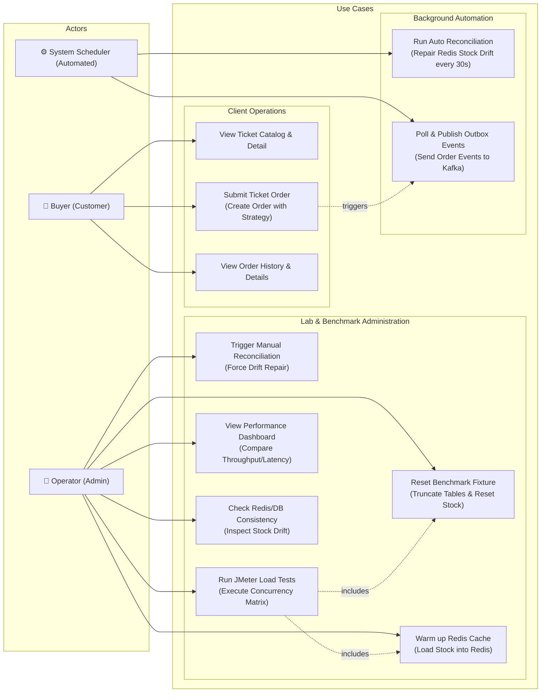

# Use Case Diagram

This document describes the Use Case diagram for the Concurrency Engine lab, defining the roles of the Operator (Admin), the Buyer (User), and the Automated System Scheduler.

---

## 1. Use Case Layout

The system divides functions into Client/Buyer use cases, Operator/Admin benchmarking controls, and Automated background tasks.

---

## 2. Description of Actors & Actions

### A. Buyer (Customer)
* **View Ticket Catalog & Detail:** The client views event information and available ticket inventory.
* **Submit Ticket Order:** The client requests to buy a ticket. The client specifies a concurrency strategy (e.g., `REDIS_LUA_WITH_COMPENSATION` or `CONDITIONAL_DB`) to test how the engine processes the order.
* **View Order History & Details:** The client checks if the order was created successfully and views the receipt.

### B. Operator (Admin)
* **Reset Benchmark Fixture:** Resets the MySQL databases and Redis cache to a clean, known starting state (e.g., stock = 1000, 0 orders).
* **Warm up Redis Cache:** Loads the initial MySQL ticket stock level directly into Redis.
* **Trigger Manual Reconciliation:** Compares Redis stock with MySQL db orders and forces the repair of any inconsistency.
* **Run JMeter Load Tests:** Runs a concurrency script using JMeter to simulate high traffic.
* **View Performance Dashboard:** Inspects charts of Throughput (TPS) and Average Latency (ms) to compare strategies.

### C. System Scheduler (Automated)
* **Run Auto Reconciliation:** A background cronjob that compares Redis and MySQL stock levels every 30 seconds and repairs them if they drift.
* **Poll & Publish Outbox Events:** A transactional outbox scheduler that sweeps pending events from the database and publishes them to the Kafka topic.
