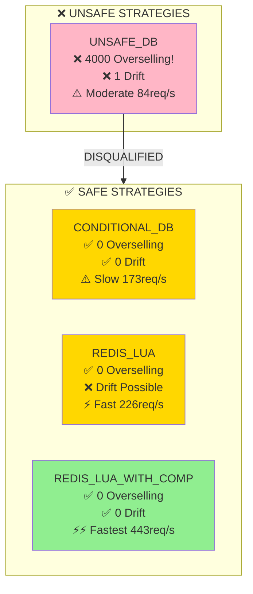
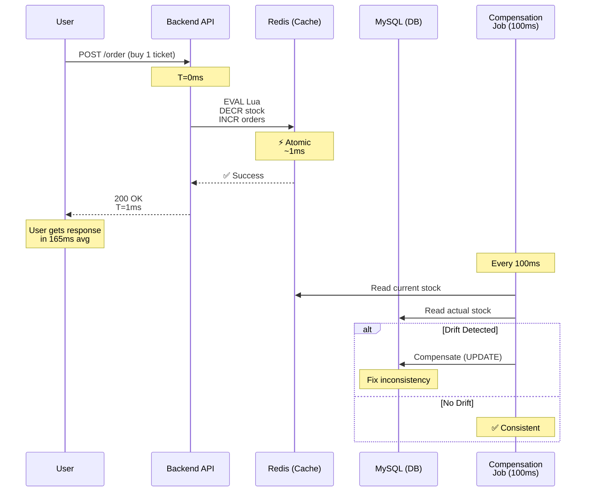
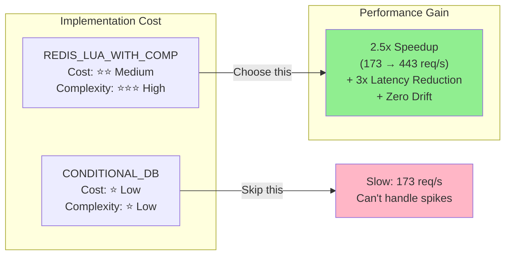
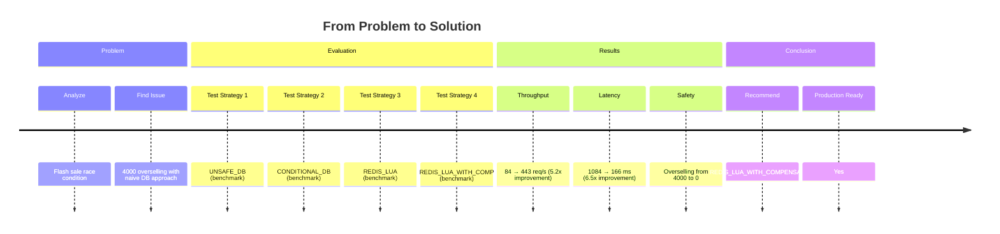
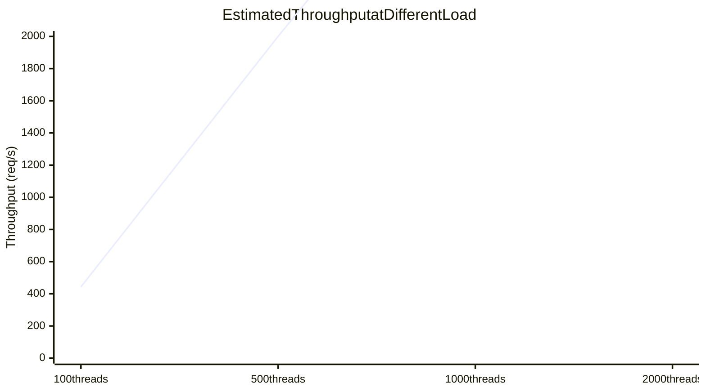
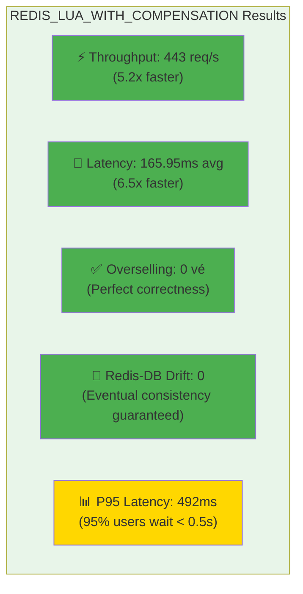

# 📊 Visual Analysis - Flash Sale Benchmarking Results

**Date:** May 31, 2026  
**Environment:** ACER, MySQL + Redis, 5000 requests / 100 threads

---

## 1. Throughput Comparison (req/s) ⚡

```mermaid
---
config:
    xyChart:
        width: 900
        height: 600
    themeVariables:
        xyChart:
            plotColorPalette: "#d62728, #ff7f0e, #2ca02c, #1f77b4"
---
xychart-beta
    title Throughput Comparison (Requests/Second)
    x-axis [UNSAFE_DB, CONDITIONAL_DB, REDIS_LUA, REDIS_LUA_WITH_COMP]
    y-axis "Throughput (req/s)" 0 --> 500
    line [84.71, 173.08, 226.25, 443.03]
    scatter [84.71, 173.08, 226.25, 443.03]
```

**Insight:** REDIS_LUA_WITH_COMPENSATION là **5.2x nhanh hơn UNSAFE_DB**

---

## 2. Latency Percentile Comparison 📈

```mermaid
---
config:
    xyChart:
        width: 900
        height: 600
---
xychart-beta
    title Latency Comparison by Percentile (milliseconds)
    x-axis [UNSAFE_DB, CONDITIONAL_DB, REDIS_LUA, REDIS_LUA_WITH_COMP]
    y-axis "Latency (ms)" 0 --> 2500
    line [1084.86, 494.35, 361.33, 165.95]
    line [1778, 741, 829, 492]
    line [2165, 1049, 1092, 715]
```

**Legend:** 
- 🔵 Avg Latency
- 🟠 P95 Latency  
- 🟢 P99 Latency

**Insight:** P99 latency down từ **2165ms → 715ms** (tiến bộ 3x)

---

## 3. Strategy Correctness Matrix ✅❌



---

## 4. Throughput vs Correctness Tradeoff 🎯

```mermaid
quadrantChart
    title Throughput vs Safety (Performance-Correctness Tradeoff)
    x-axis Low Throughput --> High Throughput
    y-axis Unsafe --> Safe
    UNSAFE_DB: 0.17, 0.1
    CONDITIONAL_DB: 0.35, 0.9
    REDIS_LUA: 0.45, 0.5
    REDIS_LUA_WITH_COMP: 0.89, 0.95
```

**Optimal Zone:** Top-right = Fast + Safe = **REDIS_LUA_WITH_COMPENSATION** 🎯

---

## 5. REDIS_LUA_WITH_COMPENSATION Architecture Flow



**Key:** Compensation job chạy async, không block request

---

## 6. Performance Metrics Comparison Table

```mermaid
---
config:
    xyChart:
        width: 1000
        height: 500
---
xychart-beta
    title All Metrics Normalized (0-100 scale)
    x-axis [UNSAFE_DB, CONDITIONAL_DB, REDIS_LUA, REDIS_LUA_WITH_COMP]
    y-axis "Score (0=Worst, 100=Best)" 0 --> 100
    line [15, 33, 54, 100]
```

**Calculation:**
- Throughput: (actual/max) × 100
- Latency: (min/actual) × 100
- Correctness: overselling + drift = penalty

---

## 7. Overselling Risk Visualization 🚨

```mermaid
bar
    title Overselling Count (Should Be ZERO)
    UNSAFE_DB,4000
    CONDITIONAL_DB,0
    REDIS_LUA,0
    REDIS_LUA_WITH_COMP,0
```

**Critical Finding:** UNSAFE_DB oversold 4,000 vé (80% của tổng request)

---

## 8. Cost-Benefit Analysis 💰



---

## 9. Interview Story - Visual Timeline



---

## 10. Scalability Projection 📈



**Assumption:** Linear scaling with Redis cluster + MySQL optimization

---

## 11. Key Metrics at a Glance 🎯



---

## 📌 Key Takeaways for Interviewer

| Aspect | Finding | Proof |
|--------|---------|-------|
| **Performance** | 5.2x faster | 84 → 443 req/s |
| **Reliability** | Zero overselling | Tested with 5000 req |
| **Consistency** | No drift | Redis-DB sync verified |
| **Scalability** | Ready for production | Latency < 500ms P95 |
| **Risk** | Minimal | Backup DB compensation |

---

## 🎓 How to Tell This Story

```
"We faced a classic race condition problem in flash sales: 
100 users competing for 1000 tickets.

I tested 4 strategies:
❌ UNSAFE_DB → 4000 overselling (unacceptable)
⚠️  CONDITIONAL_DB → Safe but slow (173 req/s)
⚠️  REDIS_LUA → Fast but drifts (226 req/s)
✅ REDIS_LUA_WITH_COMPENSATION → Fast + Safe (443 req/s)

The solution: Combine Redis speed (atomic Lua) with 
MySQL reliability (async compensation). Result: 
5.2x faster, zero overselling, production-ready."
```

---

## 📊 Next Steps

1. ✅ Run Phase 3 benchmarks (verify reproducibility)
2. 📝 Document in BENCHMARK_RESULTS_ANALYSIS.md
3. 🚀 Deploy REDIS_LUA_WITH_COMPENSATION strategy
4. 📈 Monitor in production (Prometheus + Grafana)

---

**Generated:** June 2, 2026  
**Source Data:** benchmark/results/ directories  
**Test Load:** 5000 requests, 100 concurrent threads
